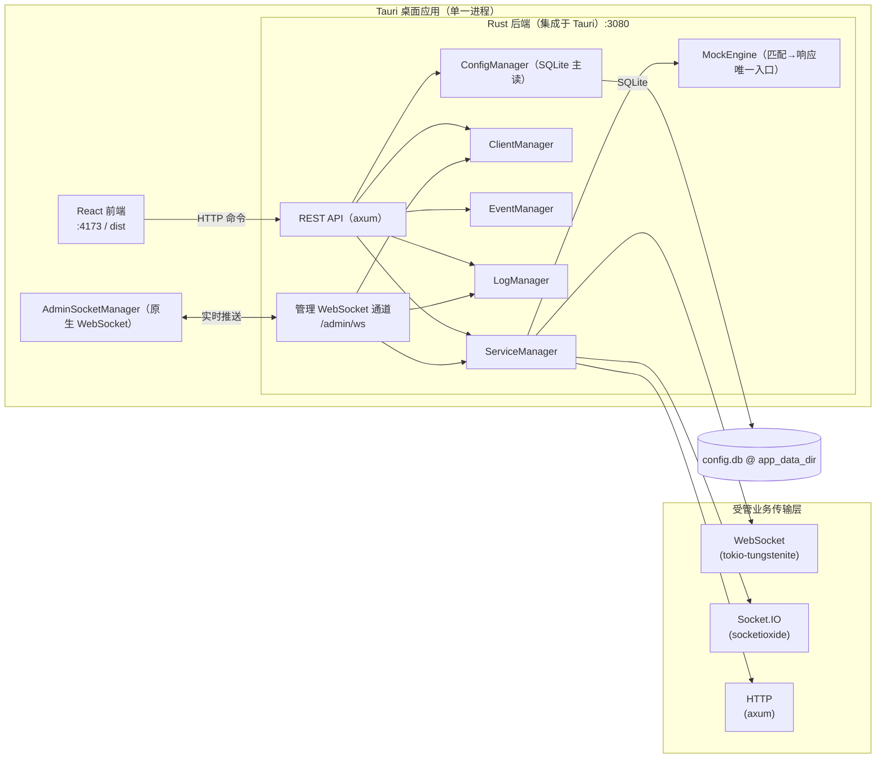

# Socket 服务管理平台

<p align="center"></p>

基于 **Tauri 2** 的桌面应用，用于统一管理、监控与调试 **WebSocket / Socket.IO / HTTP** 服务与 **Mock HTTP**。前端提供可视化控制台，**后端由 Rust 实现并直接集成进 Tauri 进程**（不再依赖独立的 Node.js 后端），负责服务生命周期、客户端连接、事件调度与 REST API；管理界面通过 **纯 WebSocket 管理通道**（`ws://localhost:3080/admin/ws`）实时接收日志、客户端列表与服务运行状态。

## 功能特性

| 模块 | 说明 |
|------|------|
| **仪表盘** | 服务运行状态、连接数等概览（实时推送） |
| **服务管理** | 创建 / 启停 / 重启 WebSocket、Socket.IO、HTTP 受管服务（可选与 Mock HTTP 共端口，仅 WebSocket / HTTP 协议支持）；受管服务由 Rust 后端实际拉起，可被外部客户端连接 |
| **Mock 工作台** | 服务内嵌 Mock（共端口）与独立 Mock 双形态；**导入 Swagger/OpenAPI 文档**批量生成规则（按文档 tags 分组、响应体按响应示例/schema 自动生成）；状态码下拉（分组+自由输入）、规则分组折叠 / 批量删除 / 一键清空、**响应参数声明式生成响应体**、接口试跑 |
| **客户端管理** | 查看在线客户端、断开连接、单播消息（实时更新） |
| **事件管理** | 按服务配置事件规则、轮询推送、默认消息 |
| **消息中心** | 消息模板、批量发送、广播；本地消息保存 / 自动填充 / 删除（localStorage 持久化） |
| **日志查看** | 关键字 / 等级 / 服务过滤，实时日志流（SQLite 持久化，跨重启可查），详情面板，导出与清空 |
| **系统设置** | 心跳、WSS、IP 黑白名单、日志保留、主题切换（亮色/深色霓虹）等；管理 API 鉴权（admin token + viewer 只读） |
| **系统托盘** | 关闭窗口隐藏到托盘而非退出；托盘菜单可显示主界面、启停全部服务；**启动时直接显示主窗口** |

## 技术栈

| 层级 | 技术 |
|------|------|
| 桌面壳 | [Tauri 2](https://tauri.app/)（Rust） |
| 前端 | React 19、TypeScript、Vite 6、Ant Design 5、Zustand、React Router 7 |
| 后端 | **Rust（集成于 `src-tauri`，随 Tauri 一并编译）**：`axum` REST + 原生 WebSocket 管理通道 `/admin/ws`、`socketioxide` 受管 Socket.IO 服务、`tokio-tungstenite` 受管 WebSocket 服务、内置 Mock HTTP 引擎（OpenAPI 3.1 类型权威源） |
| 存储 | **SQLite**（`config.db` 主读；JSON 为逃生门）；日志 `logs.db`、鉴权 `auth.db`、审计 `audit.db`——全部位于应用数据目录（`app_data_dir`，可用 `SSM_DATA_DIR` 覆盖） |

## 架构概览

前端采用 **REST + WebSocket 双通道**：

- **REST**（`http://localhost:3080/api/*`）：服务启停、配置读写、消息发送等命令操作
- **管理 WebSocket 通道**（`ws://localhost:3080/admin/ws`）：日志、客户端列表、服务运行时状态的实时推送（原生 WebSocket，非 Socket.IO）



> 后端随 Tauri 进程启动并绑定 `3080` 端口，无需单独运行后端；纯 `npm run dev`（浏览器）方式无后端，管理功能不可用。

## 目录结构

```
socket-service-manager/
├── src/                    # React 前端
│   ├── pages/              # 各功能页面
│   ├── store/              # Zustand 状态
│   ├── socket/             # AdminSocketManager（管理通道单例，原生 WebSocket）
│   ├── api/client.ts       # REST 客户端
│   └── types/              # 类型（generated.ts 由 Rust specta/OpenAPI 生成，权威源）
├── src-tauri/              # Tauri 2 + Rust 工程（含后端）
│   └── src/backend/        # Rust 后端：api / mock / transport / repository / managers / auth / audit
├── design/                 # Logo 设计源文件（本地，不入库）
├── docs/                   # 设计 / 架构 / 计划文档（本地，不入库）
├── .env.example            # 环境变量示例
├── index.html
└── dist/                   # 前端构建产物（git 忽略）
```

> 运行时数据不在仓库内：位于系统应用数据目录（Windows 默认 `%APPDATA%\com.socket-service-manager`）。

## 环境要求

- **Node.js** ≥ 18（推荐 20+）— 仅用于前端开发与构建
- **npm** 或 **pnpm**
- **Rust** stable（构建 Tauri 桌面版时需要）
- **Windows**：构建 NSIS 安装包需已安装 [WebView2](https://developer.microsoft.com/microsoft-edge/webview2/) 与 NSIS

## 快速开始

### 1. 安装依赖

```bash
# 项目根目录 — 前端依赖
npm install
```

> Rust 后端随 Tauri 编译，无需单独 `npm install` 后端。

### 2. 环境变量（可选）

复制 `.env.example` 为 `.env` 并按需修改：

| 变量 | 说明 | 默认值 |
|------|------|--------|
| `API_PORT` | 后端 API 端口 | `3080` |
| `ALLOWED_ORIGIN` | CORS 允许来源 | `http://localhost:4173` |
| `VITE_API_BASE` | 前端 REST 地址 | `http://localhost:3080` |
| `VITE_ADMIN_WS_PATH` | 管理 WebSocket 路径 | `/admin/ws` |
| `SSM_DATA_DIR` | 数据目录覆盖（默认系统应用数据目录） | `app_data_dir` |
| `SSM_REPOSITORY` | 存储模式：`sqlite`（默认）/ `json`（逃生门） | `sqlite` |

### 3. 启动开发环境

```bash
npx tauri dev
```

浏览器访问 [http://localhost:4173](http://localhost:4173)。后端随 Tauri 进程启动，无需单独运行。

### 4. 仅前端开发（无后端）

```bash
npm run dev          # 仅起 Vite 前端（浏览器访问 :4173）
```

> 此模式无 Rust 后端，`/admin/ws` 与 REST API 不可用，仅用于纯前端 UI 调试。

## 构建与打包

```bash
npx tauri build      # beforeBuildCommand 自动 tsc && vite build，输出 NSIS 安装包
```

安装包路径示例：`src-tauri/target/release/bundle/nsis/Socket 服务管理平台_x64-setup.exe`

> 后端已编译进 Tauri 二进制，安装包即包含完整前后端，无需额外部署 Node 后端。

## 数据存储

运行时数据位于系统**应用数据目录**（`app_data_dir`，Windows 默认 `%APPDATA%\com.socket-service-manager`，可用 `SSM_DATA_DIR` 覆盖）：

| 文件 | 内容 |
|------|------|
| `config/config.db` | **主配置 SQLite**（服务、事件、Mock 规则、场景、系统设置） |
| `config/config.json` | JSON 逃生门（仅 `SSM_REPOSITORY=json` 时启用；sqlite 模式启动时幂等迁移导入） |
| `logs/logs.db` | 消息日志（SQLite，跨重启可查） |
| `logs/*.log` | 当日文本运行日志 |
| `auth.db` | 鉴权 token（admin token + 角色） |
| `audit.db` | 审计日志 |

> 新电脑首次运行会自动初始化全部数据文件（空配置 + 新 admin token）。迁移数据：拷贝整个数据目录即可。

## 系统托盘（桌面版）

| 行为 | 说明 |
|------|------|
| **启动** | 直接显示主窗口（不最小化到托盘） |
| **关闭窗口** | 点击标题栏关闭按钮时隐藏到托盘，**不会退出进程** |
| **恢复窗口** | 托盘菜单选择「显示主界面」，或左键托盘图标打开菜单后显示 |
| **真正退出** | 托盘菜单选择「退出」 |

## REST API

基础地址：`http://localhost:3080`，路径统一带 `/api` 前缀（前端 `api/client.ts` 会自动补全）。管理 API 带鉴权（默认 admin token，可在设置中查看/更换；viewer 角色只读）。

| 分类 | 示例路径 | 方法 |
|------|----------|------|
| 服务 | `/api/servers`、`/api/server/list`、`/api/server/start`、`/api/server/stop-all` | GET / POST |
| Mock | `/api/mock/*`（规则/场景/导入） | GET / POST |
| 事件 | `/api/events`、`/api/events/add`、`/api/events/toggle` | GET / POST |
| 客户端 | `/api/clients`、`/api/client/send`、`/api/client/disconnect` | GET / POST |
| 消息 | `/api/send-message`、`/api/templates` | POST / GET |
| 日志 | `/api/logs`、`/api/logs/clear` | GET / POST |
| 设置 | `/api/settings`、`/api/export`、`/api/import` | GET / POST |

响应格式：`{ success: boolean, data?: T, error?: string }`。完整契约见 `src-tauri/openapi.json`（OpenAPI 3.1）。

## 管理 WebSocket 通道

管理界面通过 `AdminSocketManager`（`src/socket/AdminSocketManager.ts`，原生 WebSocket 实现）连接后端挂载于 `:3080` 的 WebSocket 端点 `/admin/ws`（**非 Socket.IO**）。

| 事件 | 方向 | 说明 |
|------|------|------|
| `heartbeat` | 服务端 → 前端 | 每 10s 心跳，前端 30s 超时判定断连 |
| `heartbeat_ack` | 前端 → 服务端 | 心跳确认，防止僵尸连接清理 |
| `runtime_update` | 服务端 → 前端 | 服务运行时状态（连接数、消息数等） |
| `client_update` | 服务端 → 前端 | 在线客户端列表 |
| `log_batch` | 服务端 → 前端 | 连接时推送最近日志 |
| `log_update` | 服务端 → 前端 | 单条新日志实时推送 |

## AI / 自动化集成

后端提供完整的 REST API（见上），可直接被脚本、AI Agent 或可调用 HTTP 的工具对接，实现无 UI 的服务管控（启动/停止服务、发送消息、查询客户端与日志等）。`src-tauri/src/backend/benchmark.rs` 提供内置压测 CLI（`cargo run --bin benchmark`）。

## 测试

```bash
# Rust 后端测试（含 Mock 引擎、传输层、存储、WS 冒烟）
cd src-tauri && cargo test --bin socket-service-manager   # 96 passed
# 前端类型检查
npx tsc --noEmit                                          # 0 errors
```

## 常见问题

**页面提示网络错误或 API 失败**  
后端已随 Tauri 进程启动；若用浏览器直接打开 `npm run dev`，则无后端，`/admin/ws` 与 API 不可用。请使用 `npx tauri dev` 或已安装的桌面程序。

**浏览器跨域访问受管 HTTP/Mock 服务被拦**  
受管服务（HttpServer 等）默认 CORS 全开；若自定义路由仍被拦，确认请求的端口与服务的 `ip:port` 一致。

**Tauri 开发白屏**  
确认 `npx tauri dev` 已正常拉起 Vite（4173 端口），并与 `tauri.conf.json` 中 `devUrl` 一致。

**数据在哪 / 想迁移到新电脑**  
见「数据存储」：默认在 `%APPDATA%\com.socket-service-manager`，拷贝整个目录即可迁移（含 token 与配置）。

## 已知限制

- **Socket.IO 与 Mock HTTP 不可共端口**：统一路由模式（UnifiedServer）依赖 axum 栈，与 `socketioxide` 的 Socket.IO 协议不兼容。为服务启用 Mock 时请使用 **WebSocket** 或 **HTTP** 协议；若对 Socket.IO 服务开启 Mock，启动会直接返回明确错误而非静默失效。
- Mock HTTP 支持「独立 Mock 服务」与「服务内嵌 Mock（共端口）」两种形态，规则匹配与响应逻辑共用同一引擎。

## 更新日志

### v3.0.0（待发布）
- **P0–P3 重构**：传输与 API 基建抽取、Mock 模型统一（单 MockEngine，独立/自定义/共端口三路一致）、前端整洁化（typed api / MockWorkbench / 类型瘦身）。
- **存储升级**：SQLite 主读（`config.db`）+ JSON 逃生门；日志/鉴权/审计独立分库；`migrate_from_json` 幂等迁移。
- **新能力**：内置压测 CLI、协议适配器骨架（TCP/UDP/MQTT/SSE 预留）、管理 API 鉴权（admin token + viewer 只读）、OpenAPI 3.1 契约发布。
- **Mock 增强**：Swagger/OpenAPI 导入（tags 分组、$ref/示例解析）、状态码下拉（分组+自由输入）、规则分组折叠 / 批量删除 / 一键清空、响应参数声明式生成响应体。
- **新 Logo**：青绿底白闪电（W1x-a），亮色主题品牌色与背景统一为青绿系；启动不再最小化到托盘。
- 详见 `CHANGELOG.md`。

### v2.0.0
- 后端架构从 Node.js sidecar 完全重写为 Rust，直接编译进 Tauri 二进制；管理通道由 Socket.IO 切换为原生 WebSocket（`/admin/ws`）；详见 `CHANGELOG.md`。

### v1.1.0
- 后端 Rust 化、管理通道改纯 WebSocket、受管服务恢复可连接、消息中心增强、仓库清理。

### v1.0.0
- 初始版本（基于 Node.js 后端 + Tauri 桌面壳）。

## 许可证

本项目采用 [Apache License 2.0](LICENSE)。
