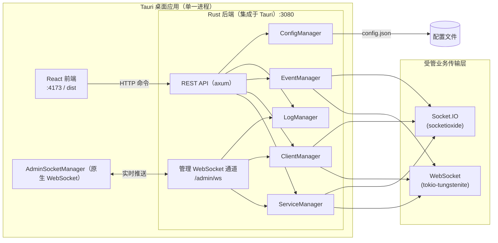

# Socket 服务管理平台

基于 **Tauri 2** 的桌面应用，用于统一管理、监控与调试 WebSocket / Socket.IO 服务。前端提供可视化控制台，**后端由 Rust 实现并直接集成进 Tauri 进程**（不再依赖独立的 Node.js 后端），负责服务生命周期、客户端连接、事件调度与 REST API；管理界面通过 **纯 WebSocket 管理通道**（`ws://localhost:3080/admin/ws`）实时接收日志、客户端列表与服务运行状态。

## 功能特性

| 模块 | 说明 |
|------|------|
| **仪表盘** | 服务运行状态、连接数等概览（实时推送） |
| **服务管理** | 创建 / 启停 / 重启 WebSocket、Socket.IO、HTTP 受管服务（可选与 Mock HTTP 共端口，仅 WebSocket / HTTP 协议支持）；受管服务由 Rust 后端实际拉起，可被外部客户端连接 |
| **客户端管理** | 查看在线客户端、断开连接、单播消息（实时更新） |
| **事件管理** | 按服务配置事件规则、轮询推送、默认消息 |
| **消息中心** | 消息模板、批量发送、广播；**本地消息保存 / 自动填充 / 删除（localStorage 持久化）** |
| **日志查看** | 关键字 / 等级 / 服务过滤，实时日志流，详情面板，导出与清空 |
| **系统设置** | 心跳、WSS、IP 黑白名单、日志保留、主题切换等 |
| **系统托盘** | 默认启动时最小化到托盘；关闭窗口隐藏而非退出；托盘菜单可显示主界面、启停全部服务 |

## 技术栈

| 层级 | 技术 |
|------|------|
| 桌面壳 | [Tauri 2](https://tauri.app/)（Rust） |
| 前端 | React 19、TypeScript、Vite 6、Ant Design 5、Zustand、React Router 7 |
| 后端 | **Rust（集成于 `src-tauri`，随 Tauri 一并编译）**：`axum` REST + 原生 WebSocket 管理通道 `/admin/ws`、`socketioxide` 受管 Socket.IO 服务、`tokio-tungstenite` 受管 WebSocket 服务、内置 Mock HTTP 引擎 |
| 存储 | JSON 配置文件（`config/config.json`） |

## 架构概览

前端采用 **REST + WebSocket 双通道**：

- **REST**（`http://localhost:3080/api/*`）：服务启停、配置读写、消息发送等命令操作
- **管理 WebSocket 通道**（`ws://localhost:3080/admin/ws`）：日志、客户端列表、服务运行时状态的实时推送（原生 WebSocket，非 Socket.IO）



> 后端随 Tauri 进程启动并绑定 `3080` 端口，无需单独运行后端；纯 `npm run dev`（浏览器）方式无后端，管理功能不可用。

## 目录结构

```
socket-service-manager/
├── src/                    # React 前端
│   ├── pages/              # 各功能页面（含 MessageCenter）
│   ├── store/              # Zustand 状态
│   ├── socket/             # AdminSocketManager（管理通道单例，原生 WebSocket）
│   ├── api/client.ts       # REST 客户端
│   └── types/              # 共享类型（含 SavedMessage）
├── src-tauri/              # Tauri 2 + Rust 工程（含后端）
│   └── src/backend/        # Rust 后端：api/router.rs、manager、transport、constants
├── config/config.json      # 运行时配置（服务、事件、系统设置）
├── docs/                   # 设计 / 架构文档
├── .env.example            # 环境变量示例
├── index.html
├── dist/                   # 前端构建产物（git 忽略）
└── test-admin-socket.mjs   # 管理通道连接测试脚本
```

> 旧版 `backend/`（Node.js 后端）、`start-dev.bat`、`build-all.sh` 已在 Rust 化后移除，请勿参考。

## 环境要求

- **Node.js** ≥ 18（推荐 20+）— 仅用于前端开发与构建
- **npm** 或 **pnpm**
- **Rust** stable（构建 Tauri 桌面版时需要）
- **Windows**：构建 NSIS 安装包需已安装 [WebView2](https://developer.microsoft.com/microsoft-edge/webview2/) 与 NSIS

## 快速开始

### 1. 安装依赖

```bash
# 项目根目录 — 前端依赖
npm install
```

> Rust 后端随 Tauri 编译，无需单独 `npm install` 后端。

### 2. 环境变量（可选）

复制 `.env.example` 为 `.env` 并按需修改：

| 变量 | 说明 | 默认值 |
|------|------|--------|
| `API_PORT` | 后端 API 端口 | `3080` |
| `ALLOWED_ORIGIN` | CORS 允许来源 | `http://localhost:4173` |
| `VITE_API_BASE` | 前端 REST 地址 | `http://localhost:3080` |
| `VITE_ADMIN_WS_PATH` | 管理 WebSocket 路径 | `/admin/ws` |

### 3. 启动开发环境

推荐直接使用 Tauri 开发命令，它会自动拉起 Vite 前端（:4173）与 Rust 后端（:3080）：

```bash
npx tauri dev
# 或
npm run dev:all
```

浏览器访问 [http://localhost:4173](http://localhost:4173)。后端随 Tauri 进程启动，无需单独运行。

### 4. 仅前端开发（无后端）

```bash
npm run dev          # 仅起 Vite 前端（浏览器访问 :4173）
```

> 此模式无 Rust 后端，`/admin/ws` 与 REST API 不可用，仅用于纯前端 UI 调试。

## 构建与打包

### 仅前端

```bash
npm run build        # 输出到 dist/
```

### Windows 安装包（NSIS）

`tauri.conf.json` 已配置 `beforeBuildCommand`（自动 `tsc && vite build`）与 `bundle.targets = nsis`，执行：

```bash
npx tauri build
```

安装包路径示例：

`src-tauri/target/release/bundle/nsis/Socket 服务管理平台_1.1.0_x64-setup.exe`

> 后端已编译进 Tauri 二进制，安装包即包含完整前后端，无需额外部署 Node 后端。

## 配置说明

主配置文件为项目根目录 **`config/config.json`**，主要字段：

| 字段 | 说明 |
|------|------|
| `servers[]` | 服务列表：`id`、`name`、`protocol`（`websocket` \| `socket.io`）、`ip`、`port`、`autoStart`、`logLevel` |
| `events[]` | 事件规则：关联 `serverId`、轮询、默认消息等 |
| `templates[]` | 消息模板 |
| `systemSettings` | 心跳间隔、WSS 证书路径、IP 黑白名单、日志保留天数、`startMinimized`（启动时最小化到托盘，**默认 `true`**）等 |
| `windowConfig` | 窗口宽高（供设置页同步） |

修改配置后可通过设置页的导入/导出，或重启应用使部分项生效。

### 系统托盘（桌面版）

Tauri 桌面应用默认以后台托盘方式运行，适合长期驻留管理 Socket 服务：

| 行为 | 说明 |
|------|------|
| **启动** | 默认不显示主窗口，仅托盘图标可见（`systemSettings.startMinimized`，默认 `true`） |
| **关闭窗口** | 点击标题栏关闭按钮时隐藏到托盘，**不会退出进程** |
| **恢复窗口** | 托盘菜单选择「显示主界面」，或左键托盘图标打开菜单后显示 |
| **真正退出** | 托盘菜单选择「退出」 |

可在 **系统设置 → 基本设置** 中关闭「启动时最小化到托盘」，下次启动将直接显示主窗口。该选项写入 `config/config.json` 的 `systemSettings.startMinimized`，Tauri 启动时从该文件读取。

## REST API

基础地址：`http://localhost:3080`，路径统一带 `/api` 前缀（前端 `api/client.ts` 会自动补全）。

| 分类 | 示例路径 | 方法 |
|------|----------|------|
| 服务 | `/api/servers`、`/api/server/list`、`/api/server/start`、`/api/server/stop-all` | GET / POST |
| 事件 | `/api/events`、`/api/events/add`、`/api/events/toggle` | GET / POST |
| 客户端 | `/api/clients`、`/api/client/send`、`/api/client/disconnect` | GET / POST |
| 消息 | `/api/send-message`、`/api/templates` | POST / GET |
| 日志 | `/api/logs`、`/api/logs/clear` | GET / POST |
| 设置 | `/api/settings`、`/api/export`、`/api/import` | GET / POST |

响应格式：`{ success: boolean, data?: T, error?: string }`。

## 管理 WebSocket 通道

管理界面通过 `AdminSocketManager`（`src/socket/AdminSocketManager.ts`，原生 WebSocket 实现）连接后端挂载于 `:3080` 的 WebSocket 端点 `/admin/ws`（**非 Socket.IO**）。

| 事件 | 方向 | 说明 |
|------|------|------|
| `heartbeat` | 服务端 → 前端 | 每 10s 心跳，前端 30s 超时判定断连 |
| `heartbeat_ack` | 前端 → 服务端 | 心跳确认，防止僵尸连接清理 |
| `runtime_update` | 服务端 → 前端 | 服务运行时状态（连接数、消息数等） |
| `client_update` | 服务端 → 前端 | 在线客户端列表 |
| `log_batch` | 服务端 → 前端 | 连接时推送最近 100 条日志 |
| `log_update` | 服务端 → 前端 | 单条新日志实时推送 |

连接地址：`{VITE_API_BASE}`，路径：`{VITE_ADMIN_WS_PATH}`（默认 `/admin/ws`）。

## AI / 自动化集成

后端提供完整的 REST API（见上），可直接被脚本、AI Agent 或可调用 HTTP 的工具对接，实现无 UI 的服务管控（启动/停止服务、发送消息、查询客户端与日志等）。

> 早期 Node 版本曾内置 MCP 工具（`backend/mcp`），Rust 化后该模块未一并移植；如需 MCP 能力可在 Rust 后端按需新增，或直接基于现有 REST API 封装。

## 测试客户端

项目根目录提供管理通道连接测试脚本（需 Tauri/Rust 后端已在 `3080` 运行）：

```bash
node test-admin-socket.mjs
```

## 常见问题

**页面提示网络错误或 API 失败**  
后端已随 Tauri 进程启动；若用浏览器直接打开 `npm run dev`，则无后端，`/admin/ws` 与 API 不可用。请使用 `npx tauri dev` 或已安装的桌面程序。

**日志 / 客户端列表不实时更新**  
检查浏览器控制台是否有 WebSocket 连接错误；确认 `VITE_ADMIN_WS_PATH` 与后端路径（`/admin/ws`）一致，且 `ALLOWED_ORIGIN` 与前端访问地址一致。

**Tauri 开发白屏**  
确认 `npx tauri dev` 已正常拉起 Vite（4173 端口），并与 `tauri.conf.json` 中 `devUrl` 一致。

**配置未生效**  
检查实际读取的是根目录 `config/config.json`；修改后可在设置页导入/导出，或重启应用使部分项生效。

**启动后看不到主窗口**  
桌面版默认最小化到托盘。查看任务栏托盘区图标，通过「显示主界面」恢复；或在设置中关闭「启动时最小化到托盘」后重启应用。

## 已知限制

- **Socket.IO 与 Mock HTTP 不可共端口**：统一路由模式（UnifiedServer）依赖 axum 栈，与 `socketioxide` 的 Socket.IO 协议不兼容。为服务启用 Mock 时请使用 **WebSocket** 或 **HTTP** 协议；若对 Socket.IO 服务开启 Mock，启动会直接返回明确错误而非静默失效（协议不会丢失）。
- Mock HTTP 支持「独立 Mock 服务」与「服务内嵌 Mock（共端口）」两种形态，规则匹配与响应逻辑共用同一引擎。

## 更新日志

### v1.1.0
- **后端 Rust 化**：后端由 Node.js 重写为 Rust，直接集成进 Tauri 进程（`src-tauri`），不再需要独立 Node sidecar 与 `backend/` 目录。
- **管理通道改为纯 WebSocket**：由 Socket.IO（`/admin/socket.io`）切换为原生 WebSocket（`/admin/ws`），前端 `AdminSocketManager` 移除 `socket.io-client` 依赖。
- **恢复受管服务**：新建并启动受管 Socket.IO / WebSocket 服务后，Rust 后端实际拉起可连接的服务实例（含 CORS 支持与外部客户端连接修复）。
- **Bug 修复**：
  - `/api/events/add` 反序列化缺少 `id` 报错（新增 `#[serde(default)]`）。
  - 消息中心发送指定客户端消息失败（`serverId` 等 camelCase 字段反序列化丢失，补充 `rename_all = "camelCase"`）。
- **消息中心增强**：新增本地消息保存 / 自动填充 / 删除（localStorage 持久化，页面刷新后仍可用）。
- **仓库清理**：移除废弃的 `start-dev.bat`、`build-all.sh`；构建产物 / 散落文件加入 `.gitignore`。

### v1.0.0
- 初始版本（基于 Node.js 后端 + Tauri 桌面壳）。

## 许可证

本项目采用 [Apache License 2.0](LICENSE)。
