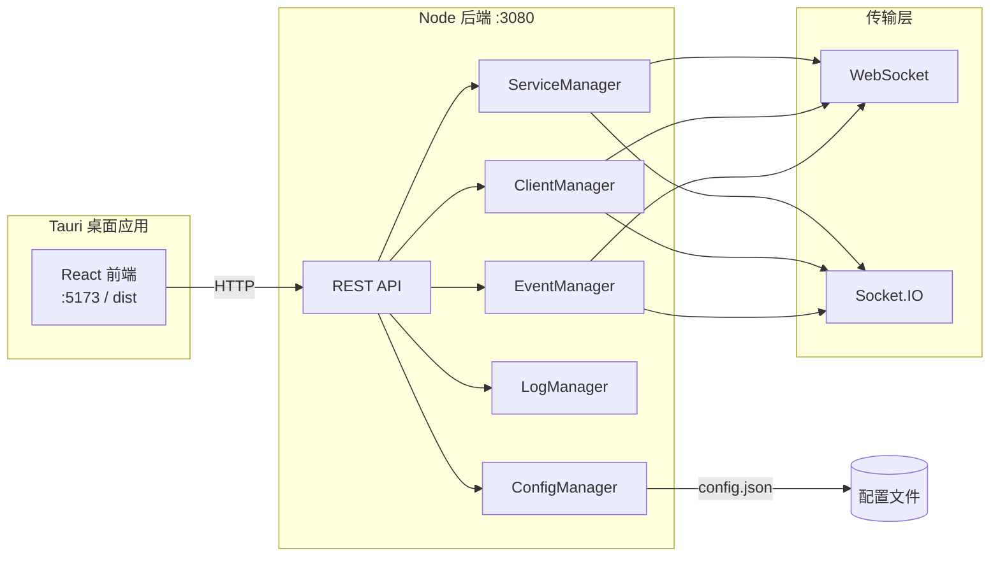

# Socket 服务管理平台

基于 **Tauri 2** 的桌面应用，用于统一管理、监控与调试 WebSocket / Socket.IO 服务。前端提供可视化控制台，后端负责服务生命周期、客户端连接、事件调度与 REST API。

## 功能特性

| 模块 | 说明 |
|------|------|
| **仪表盘** | 服务运行状态、连接数等概览 |
| **服务管理** | 创建 / 启停 / 重启 WebSocket、Socket.IO 监听服务 |
| **客户端管理** | 查看在线客户端、断开连接、单播消息 |
| **事件管理** | 按服务配置事件规则、轮询推送、默认消息 |
| **消息中心** | 消息模板、批量发送、广播 |
| **日志查看** | 按级别、服务、时间筛选运行日志 |
| **系统设置** | 心跳、WSS、IP 黑白名单、日志保留等 |
| **系统托盘** | 最小化到托盘，快捷显示窗口与退出（部分托盘操作待与后端联动） |

## 技术栈

| 层级 | 技术 |
|------|------|
| 桌面壳 | [Tauri 2](https://tauri.app/)（Rust） |
| 前端 | React 19、TypeScript、Vite 6、Ant Design 5、Zustand、React Router 7 |
| 后端 | Node.js、TypeScript、原生 `http` REST、`ws` / `socket.io` |
| 存储 | [lowdb](https://github.com/nanowins/lowdb)（JSON 配置持久化） |

## 架构概览



开发时前端与后端分别启动；生产构建可将前端产物打包进 Tauri，后端需单独运行或由安装包一并部署。

## 目录结构

```
socket-service-manager/
├── src/                    # React 前端
│   ├── pages/              # 各功能页面
│   ├── store/              # Zustand 状态
│   └── api/client.ts       # REST 客户端（默认 http://localhost:3080）
├── backend/                # Node 后端
│   ├── main.ts             # 应用入口与 Manager 编排
│   ├── api/                # REST 路由
│   ├── manager/            # 业务 Manager
│   ├── transport/          # WebSocket / Socket.IO 实现
│   ├── mcp/                # MCP 工具定义（供 AI 集成）
│   └── config/config.json  # 后端默认配置（可被根目录 config 覆盖）
├── config/config.json      # 运行时配置（服务、事件、系统设置）
├── src-tauri/              # Tauri Rust 工程
├── build-all.sh            # 一键构建脚本（Bash）
└── dist/                   # 前端构建产物（git 忽略）
```

## 环境要求

- **Node.js** ≥ 18（推荐 20+）
- **npm** 或 **pnpm**
- **Rust** stable（仅构建 Tauri 桌面版时需要）
- **Windows**：构建 NSIS 安装包需已安装 [WebView2](https://developer.microsoft.com/microsoft-edge/webview2/)

## 快速开始

### 1. 安装依赖

```bash
# 项目根目录 — 前端
npm install

# 后端
cd backend && npm install && cd ..
```

### 2. 启动后端

```bash
cd backend
npm run dev          # 开发：tsx watch main.ts
# 或
npm run build && npm start   # 生产：编译后运行 dist/main.js
```

后端默认监听 **http://localhost:3080**，启动成功后会加载 `config/config.json`（或 `backend/config/config.json`）中的服务列表。

### 3. 启动前端

在项目根目录另开终端：

```bash
npm run dev
```

浏览器访问 [http://localhost:5173](http://localhost:5173)。请确保后端已启动，否则页面 API 调用会失败。

### 4. Tauri 桌面开发（可选）

需已安装 Rust 与 Tauri CLI：

```bash
# 先启动前端 dev server（tauri.conf.json 中 devUrl 指向 5173）
npm run dev

# 另开终端
cd src-tauri
cargo tauri dev
# 或使用 npx（若已全局/本地安装 CLI）
npx tauri dev
```

## 构建与打包

### 仅前端

```bash
npm run build        # 输出到 dist/
```

### 后端

```bash
cd backend
npm run build        # 输出到 backend/dist/
```

### 完整构建（Bash）

在项目根目录执行（Windows 可用 Git Bash / WSL）：

```bash
bash build-all.sh
```

脚本依次：构建前端 → 编译后端 → 检查 Tauri 图标 → `cargo build --release`。

### Windows 安装包（NSIS）

```bash
npm run build
cd src-tauri
cargo tauri build
```

安装包路径示例：

`src-tauri/target/release/bundle/nsis/Socket 服务管理平台_0.1.0_x64-setup.exe`

> **说明**：当前 `tauri.conf.json` 中 `beforeBuildCommand` 为空，打包前请手动执行 `npm run build` 生成 `dist/`。桌面应用展示 UI 后，仍需确保 Node 后端在 `3080` 端口运行（或将后端一并打包进发布流程）。

## 配置说明

主配置文件为项目根目录 **`config/config.json`**，主要字段：

| 字段 | 说明 |
|------|------|
| `servers[]` | 服务列表：`id`、`name`、`protocol`（`websocket` \| `socket.io`）、`ip`、`port`、`autoStart`、`logLevel` |
| `events[]` | 事件规则：关联 `serverId`、轮询、默认消息等 |
| `templates[]` | 消息模板 |
| `systemSettings` | 心跳间隔、WSS 证书路径、IP 黑白名单、日志保留天数等 |
| `windowConfig` | 窗口宽高（供设置页同步） |

修改配置后可通过设置页的导入/导出，或重启后端使部分项生效。

## REST API

基础地址：`http://localhost:3080`，路径统一带 `/api` 前缀（前端 `api/client.ts` 会自动补全）。

| 分类 | 示例路径 | 方法 |
|------|----------|------|
| 服务 | `/api/servers`、`/api/server/list`、`/api/server/start`、`/api/server/stop-all` | GET / POST |
| 事件 | `/api/events`、`/api/events/add`、`/api/events/toggle` | GET / POST |
| 客户端 | `/api/clients`、`/api/client/send`、`/api/client/disconnect` | GET / POST |
| 消息 | `/api/send-message`、`/api/templates` | POST / GET |
| 日志 | `/api/logs`、`/api/logs/clear` | GET / POST |
| 设置 | `/api/settings`、`/api/export`、`/api/import` | GET / POST |

响应格式：`{ success: boolean, data?: T, error?: string }`。

## MCP 集成

`backend/mcp/index.ts` 定义了可供 LLM / MCP 客户端调用的工具 schema，例如：

- `start_server` / `stop_server` / `restart_server`
- `send_message` / `broadcast_message`
- `get_clients` / `get_logs`

可在自动化脚本或 AI Agent 中对接这些工具，实现无 UI 的服务管控。

## 测试客户端

后端提供简单测试脚本（需在对应端口已有服务监听）：

```bash
cd backend
node test-websocket-client.cjs
node test-poll-client.cjs
```

## 常见问题

**页面提示网络错误或 API 失败**  
确认 `backend` 已启动且 `3080` 端口未被占用。

**Tauri 开发白屏**  
确认 `npm run dev` 已在 5173 端口运行，并与 `tauri.conf.json` 中 `devUrl` 一致。

**配置未生效**  
检查实际读取的是根目录 `config/config.json` 还是 `backend/config/config.json`，避免改错文件。

## 许可证

本项目采用 [Apache License 2.0](LICENSE)。
