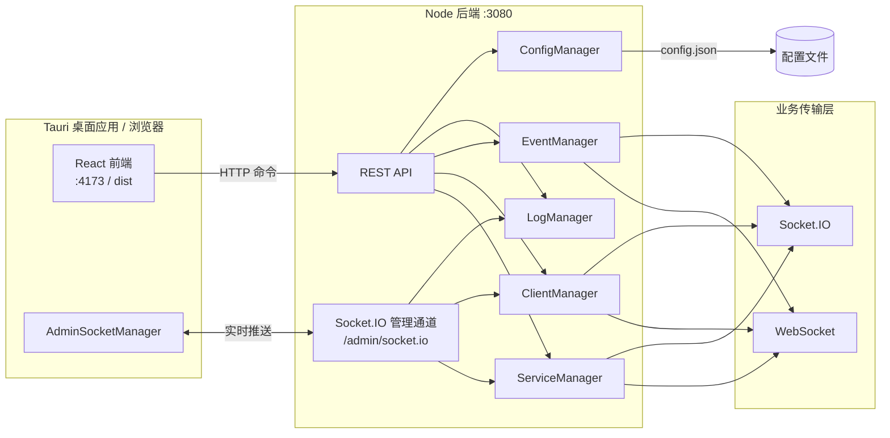

# Socket 服务管理平台

基于 **Tauri 2** 的桌面应用，用于统一管理、监控与调试 WebSocket / Socket.IO 服务。前端提供可视化控制台，后端负责服务生命周期、客户端连接、事件调度与 REST API；管理界面通过 **Socket.IO 管理通道** 实时接收日志、客户端列表与服务运行状态。

## 功能特性

| 模块 | 说明 |
|------|------|
| **仪表盘** | 服务运行状态、连接数等概览（实时推送） |
| **服务管理** | 创建 / 启停 / 重启 WebSocket、Socket.IO 监听服务 |
| **客户端管理** | 查看在线客户端、断开连接、单播消息（实时更新） |
| **事件管理** | 按服务配置事件规则、轮询推送、默认消息 |
| **消息中心** | 消息模板、批量发送、广播 |
| **日志查看** | 关键字 / 等级 / 服务过滤，实时日志流，详情面板，导出与清空 |
| **系统设置** | 心跳、WSS、IP 黑白名单、日志保留、主题切换等 |
| **系统托盘** | 默认启动时最小化到托盘；关闭窗口隐藏而非退出；托盘菜单可显示主界面、启停全部服务 |

## 技术栈

| 层级 | 技术 |
|------|------|
| 桌面壳 | [Tauri 2](https://tauri.app/)（Rust） |
| 前端 | React 19、TypeScript、Vite 6、Ant Design 5、Zustand、React Router 7、Socket.IO Client |
| 后端 | Node.js、TypeScript、原生 `http` REST、`ws` / `socket.io` |
| 存储 | [lowdb](https://github.com/nanowins/lowdb)（JSON 配置持久化） |

## 架构概览

前端采用 **REST + Socket.IO 双通道**：

- **REST**（`http://localhost:3080/api/*`）：服务启停、配置读写、消息发送等命令操作
- **Socket.IO 管理通道**（`/admin/socket.io`）：日志、客户端列表、服务运行时状态的实时推送



开发时前端与后端分别启动（或使用一键脚本）；生产构建可将前端产物打包进 Tauri，后端需单独运行或由安装包一并部署。

## 目录结构

```
socket-service-manager/
├── src/                    # React 前端
│   ├── pages/              # 各功能页面
│   ├── store/              # Zustand 状态
│   ├── socket/             # AdminSocketManager（管理通道单例）
│   └── api/client.ts       # REST 客户端
├── backend/                # Node 后端
│   ├── main.ts             # 应用入口与 Manager 编排
│   ├── api/                # REST 路由 + Socket.IO 管理通道
│   ├── manager/            # 业务 Manager
│   ├── transport/          # WebSocket / Socket.IO 实现
│   ├── mcp/                # MCP 工具定义（供 AI 集成）
│   └── config/config.json  # 后端默认配置（可被根目录 config 覆盖）
├── config/config.json      # 运行时配置（服务、事件、系统设置）
├── src-tauri/              # Tauri Rust 工程
├── .env.example            # 环境变量示例
├── start-dev.bat           # Windows 一键启动前后端
├── build-all.sh            # 一键构建脚本（Bash）
└── dist/                   # 前端构建产物（git 忽略）
```

## 环境要求

- **Node.js** ≥ 18（推荐 20+）
- **npm** 或 **pnpm**
- **Rust** stable（仅构建 Tauri 桌面版时需要）
- **Windows**：构建 NSIS 安装包需已安装 [WebView2](https://developer.microsoft.com/microsoft-edge/webview2/)

## 快速开始

### 1. 安装依赖

```bash
# 项目根目录 — 前端
npm install

# 后端
cd backend && npm install && cd ..
```

### 2. 环境变量（可选）

复制 `.env.example` 为 `.env` 并按需修改：

| 变量 | 说明 | 默认值 |
|------|------|--------|
| `API_PORT` | 后端 API 端口 | `3080` |
| `ALLOWED_ORIGIN` | CORS 允许来源 | `http://localhost:4173` |
| `VITE_API_BASE` | 前端 REST 地址 | `http://localhost:3080` |
| `VITE_ADMIN_SOCKET_PATH` | 管理 Socket.IO 路径 | `/admin/socket.io` |

### 3. 启动开发环境

**方式 A — 一键启动（推荐）**

```bash
# 同时启动前端 (:4173) 与后端 (:3080)
npm run dev:all
```

Windows 也可双击或执行：

```bat
start-dev.bat
```

**方式 B — 分别启动**

```bash
# 终端 1：后端
cd backend
npm run dev          # tsx watch main.ts

# 终端 2：前端（项目根目录）
npm run dev
```

浏览器访问 [http://localhost:4173](http://localhost:4173)。请确保后端已启动，否则页面 API 调用与管理通道连接会失败。

### 4. Tauri 桌面开发（可选）

需已安装 Rust 与 Tauri CLI。`tauri.conf.json` 已配置 `beforeDevCommand: npm run dev:all`，执行 `tauri dev` 时会自动拉起前后端：

```bash
cd src-tauri
cargo tauri dev
# 或
npx tauri dev
```

## 构建与打包

### 仅前端

```bash
npm run build        # 输出到 dist/
```

### 后端

```bash
cd backend
npm run build        # 输出到 backend/dist/
```

### 完整构建（Bash）

在项目根目录执行（Windows 可用 Git Bash / WSL）：

```bash
bash build-all.sh
```

脚本依次：构建前端 → 编译后端 → 检查 Tauri 图标 → `cargo build --release`。

### Windows 安装包（NSIS）

```bash
npm run build
cd src-tauri
cargo tauri build
```

安装包路径示例：

`src-tauri/target/release/bundle/nsis/Socket 服务管理平台_1.0.0_x64-setup.exe`

> **说明**：当前 `tauri.conf.json` 中 `beforeBuildCommand` 为空，打包前请手动执行 `npm run build` 生成 `dist/`。桌面应用展示 UI 后，仍需确保 Node 后端在 `3080` 端口运行（或将后端一并打包进发布流程）。

## 配置说明

主配置文件为项目根目录 **`config/config.json`**，主要字段：

| 字段 | 说明 |
|------|------|
| `servers[]` | 服务列表：`id`、`name`、`protocol`（`websocket` \| `socket.io`）、`ip`、`port`、`autoStart`、`logLevel` |
| `events[]` | 事件规则：关联 `serverId`、轮询、默认消息等 |
| `templates[]` | 消息模板 |
| `systemSettings` | 心跳间隔、WSS 证书路径、IP 黑白名单、日志保留天数、`startMinimized`（启动时最小化到托盘，**默认 `true`**）等 |
| `windowConfig` | 窗口宽高（供设置页同步） |

修改配置后可通过设置页的导入/导出，或重启后端使部分项生效。

### 系统托盘（桌面版）

Tauri 桌面应用默认以后台托盘方式运行，适合长期驻留管理 Socket 服务：

| 行为 | 说明 |
|------|------|
| **启动** | 默认不显示主窗口，仅托盘图标可见（`systemSettings.startMinimized`，默认 `true`） |
| **关闭窗口** | 点击标题栏关闭按钮时隐藏到托盘，**不会退出进程** |
| **恢复窗口** | 托盘菜单选择「显示主界面」，或左键托盘图标打开菜单后显示 |
| **真正退出** | 托盘菜单选择「退出」 |

可在 **系统设置 → 基本设置** 中关闭「启动时最小化到托盘」，下次启动将直接显示主窗口。该选项写入 `config/config.json` 的 `systemSettings.startMinimized`，Tauri 启动时从该文件读取。

## REST API

基础地址：`http://localhost:3080`，路径统一带 `/api` 前缀（前端 `api/client.ts` 会自动补全）。

| 分类 | 示例路径 | 方法 |
|------|----------|------|
| 服务 | `/api/servers`、`/api/server/list`、`/api/server/start`、`/api/server/stop-all` | GET / POST |
| 事件 | `/api/events`、`/api/events/add`、`/api/events/toggle` | GET / POST |
| 客户端 | `/api/clients`、`/api/client/send`、`/api/client/disconnect` | GET / POST |
| 消息 | `/api/send-message`、`/api/templates` | POST / GET |
| 日志 | `/api/logs`、`/api/logs/clear` | GET / POST |
| 设置 | `/api/settings`、`/api/export`、`/api/import` | GET / POST |

响应格式：`{ success: boolean, data?: T, error?: string }`。

## Socket.IO 管理通道

管理界面通过 `AdminSocketManager`（`src/socket/AdminSocketManager.ts`）连接后端挂载于同一 HTTP 服务器的 Socket.IO 实例。

| 事件 | 方向 | 说明 |
|------|------|------|
| `heartbeat` | 服务端 → 前端 | 每 10s 心跳，前端 30s 超时判定断连 |
| `heartbeat_ack` | 前端 → 服务端 | 心跳确认，防止僵尸连接清理 |
| `runtime_update` | 服务端 → 前端 | 服务运行时状态（连接数、消息数等） |
| `client_update` | 服务端 → 前端 | 在线客户端列表 |
| `log_batch` | 服务端 → 前端 | 连接时推送最近 100 条日志 |
| `log_update` | 服务端 → 前端 | 单条新日志实时推送 |

连接地址：`{VITE_API_BASE}`，路径：`{VITE_ADMIN_SOCKET_PATH}`（默认 `/admin/socket.io`）。

## MCP 集成

`backend/mcp/index.ts` 定义了可供 LLM / MCP 客户端调用的工具 schema，例如：

- `start_server` / `stop_server` / `restart_server`
- `send_message` / `broadcast_message`
- `get_clients` / `get_logs`

可在自动化脚本或 AI Agent 中对接这些工具，实现无 UI 的服务管控。

## 测试客户端

后端提供简单测试脚本（需在对应端口已有服务监听）：

```bash
cd backend
node test-websocket-client.cjs
node test-poll-client.cjs
```

项目根目录另有管理通道测试脚本：

```bash
node test-admin-socket.mjs
```

## 常见问题

**页面提示网络错误或 API 失败**  
确认 `backend` 已启动且 `3080` 端口未被占用。

**日志 / 客户端列表不实时更新**  
检查浏览器控制台是否有 Socket.IO 连接错误；确认 `ALLOWED_ORIGIN` 与前端访问地址一致。

**Tauri 开发白屏**  
确认 `npm run dev:all` 或 `npm run dev` 已在 4173 端口运行，并与 `tauri.conf.json` 中 `devUrl` 一致。

**配置未生效**  
检查实际读取的是根目录 `config/config.json` 还是 `backend/config/config.json`，避免改错文件。

**启动后看不到主窗口**  
桌面版默认最小化到托盘。查看任务栏托盘区图标，通过「显示主界面」恢复；或在设置中关闭「启动时最小化到托盘」后重启应用。

## 许可证

本项目采用 [Apache License 2.0](LICENSE)。
