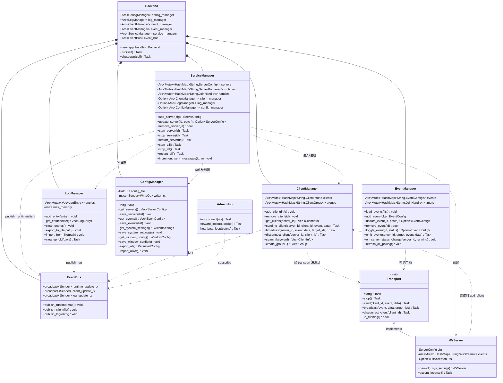
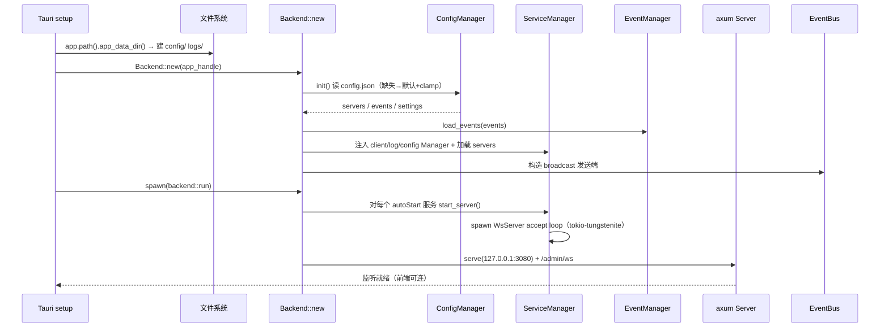
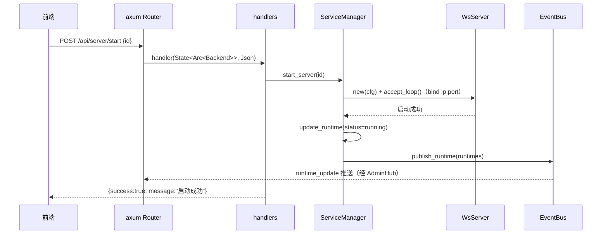
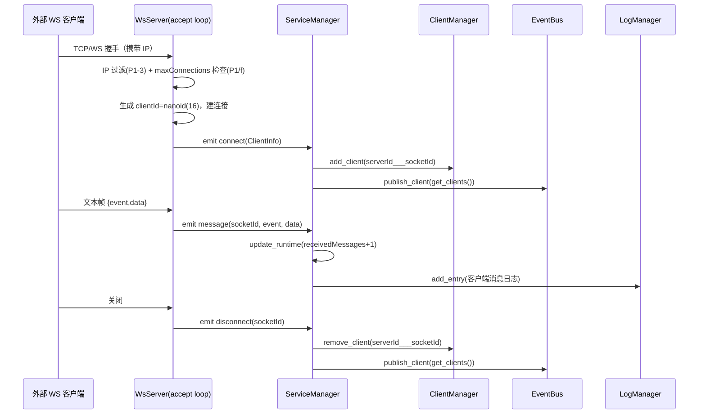
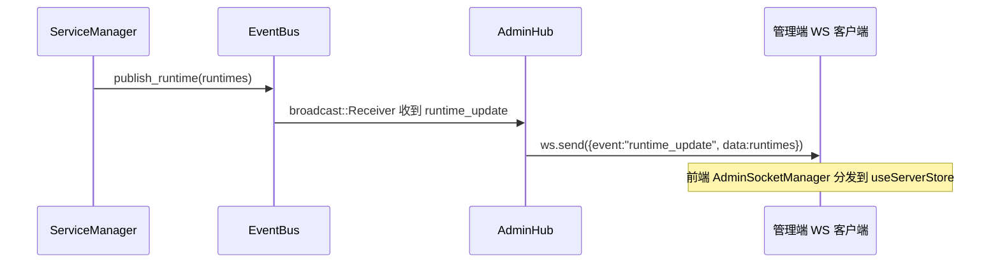
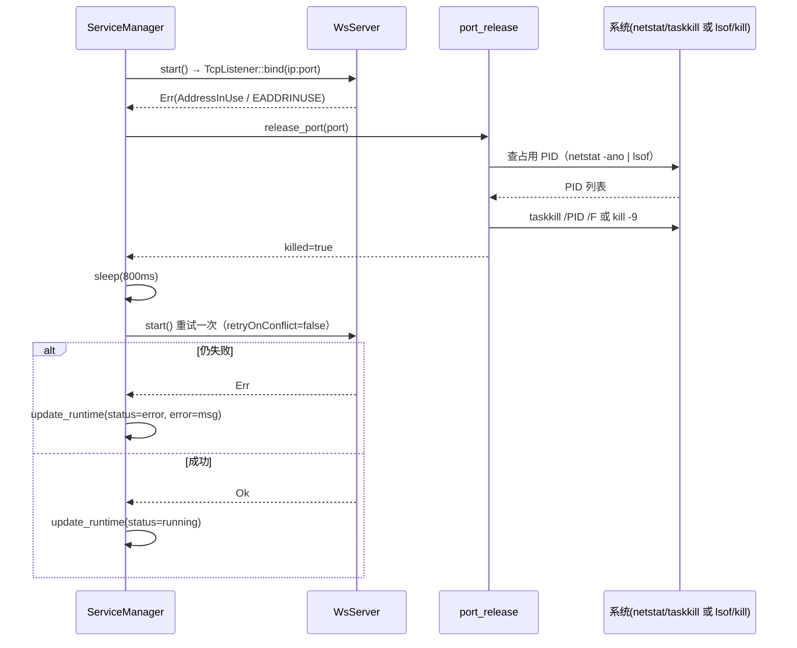
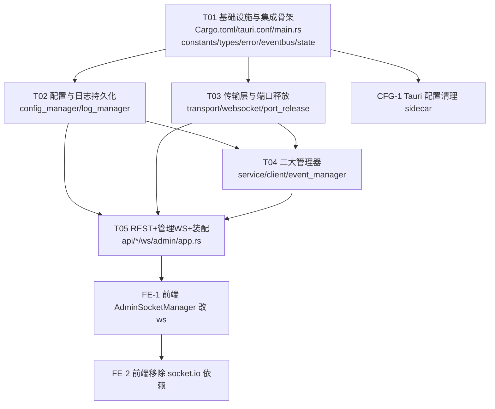

# 架构设计文档：socket-service-manager 后端 Rust 重写

- **文档版本**：v1.0
- **作者**：架构师 高见远（Gao）
- **日期**：2025
- **对应 PRD**：`docs/prd-rust-backend-rewrite.md`
- **语言**：简体中文
- **范围**：仅架构设计 + 任务分解，不含实现代码

---

## 一、实现方案与框架选型

### 1.1 核心难点

| 难点 | 说明 | 应对策略 |
|---|---|---|
| 进程模型改变 | Node 独立 sidecar 进程 → 编译进 Tauri 二进制，随应用启动 | 后端作为 Tauri `setup` 中 `tauri::async_runtime::spawn` 起的后台 tokio 任务，监听 `127.0.0.1:3080` |
| 实时协议切换 | 前端管理通道 Socket.IO → 纯 WebSocket | 管理通道用 axum `extract::ws`；受管服务用 tokio-tungstenite 各起一个 WS 服务端 |
| 共享可变状态 | 5 个 Manager 互相关联、跨 REST/WS/定时器访问 | `Arc<Backend>`，各 Manager 内部以 `Arc<tokio::sync::Mutex<HashMap<…>>>` 持有状态；跨 Manager 解耦用 `tokio::sync::broadcast` 事件总线 |
| 端口冲突释放 | Node `killPort` 依赖 `lsof`/`netstat`+`taskkill` | `std::process::Command` 等价实现（Unix `lsof -ti :port`+`kill -9`；Windows `netstat -ano`+`taskkill /PID /F`），释放后 800ms 重试一次 |
| 数据目录迁移 | `SSM_DATA_DIR`/`cwd` → Tauri `app_data_dir()` | `setup` 中解析 `app.path().app_data_dir()`，建 `config/`、`logs/`，首次运行尝试从旧目录迁移 `config.json` |
| 并发写 config.json | 原 Node 每次读写都全量 fs | 单写者 `mpsc` channel 串行化写，避免并发覆盖 |

### 1.2 框架选型（最终决策）

| 关注点 | 选型 | 决策理由 |
|---|---|---|
| 异步运行时 | **tokio**（rt-multi-thread, macros, net, time, sync, io-util） | Tauri 2 内置即 tokio；后端直接复用 `tauri::async_runtime`，无需自建 runtime，避免双 runtime 冲突 |
| REST 框架 | **axum 0.7** + **tower-http（cors）** | 路由声明清晰；`extract::State<Arc<Backend>>` 天然共享 AppState；tower CORS 中间件满足 `Access-Control-Allow-Origin` |
| 受管服务 WS 服务端 | **tokio-tungstenite 0.24** | 每个 `ServerConfig` 独立 `ip:port`、独立 start/stop 生命周期，需各起一个 `TcpListener` 做 accept loop；axum 单地址模型不适合动态增减监听器；WSS 也需每服务独立 `TlsAcceptor` |
| 管理端 WS 通道 | **axum::extract::ws**（挂在 axum Router，`/admin/ws`，端口 3080） | 与 REST 共用同一 HTTP 服务器/端口/CORS/State，零额外监听；各连接 handler 订阅事件总线 `broadcast::Receiver` 向 socket 转发 |
| 序列化 | **serde** + **serde_json** | 与 TS 契约 1:1 对应；config.json 读写 |
| 错误处理 | **anyhow**（内部）+ **thiserror**（BackendError 枚举） | 统一 `Result<T, BackendError>`；REST 层映射为错误码 |
| 日志（诊断） | **tracing** + **tracing-subscriber**（fmt layer） | Rust 内部诊断输出到 stderr（Tauri 捕获）；与业务日志系统分离 |
| 业务日志系统 | 自研 `LogManager`（内存环形 + 按日文件） | 等同 Node `LogManager`，领域日志走它而非 tracing |
| 持久化 | **serde_json** + **std::fs** + 单写者 **mpsc** | 纯 JSON 单文件，零 DB 依赖；写串行化 |
| 时间/ID | **chrono**（ISO8601）、**nanoid**（16 位连接/服务 id）、**uuid**（日志条目 id） | 对齐 Node（`new Date().toISOString()` → `chrono::Utc::now().to_rfc3339()`；`nanoid(16)`；`crypto.randomUUID()` → `uuid::Uuid::new_v4()`） |
| WSS（P1-2，可选） | **tokio-rustls** + **rustls** + **rustls-pemfile** | 避免 openssl/native-tls 在 Windows 的编译负担；仅受管服务启用，证书缺失降级纯 WS |

> 结论：管理通道用 **axum::extract::ws**（与 REST 同端口同服务器），受管服务用 **tokio-tungstenite**（每服务独立监听）。两者都发/收 `{event, data}` JSON 帧，对前端透明。

---

## 二、Tauri 集成方案（如何在 setup 中启动异步后端）

### 2.1 整体模型

```
Tauri 进程
 └─ 主线程 (setup 闭包)
     ├─ 解析 app_data_dir()，创建 config/ 与 logs/
     ├─ 构造 Arc<Backend>（加载 config.json、装配各 Manager + EventBus）
     ├─ app.manage(Arc<Backend>)                // 注入 Tauri 状态（可选，供 Tauri 命令访问）
     └─ tauri::async_runtime::spawn(backend::run(app_handle))
            ├─ 启动自动启动的服务（spawn 各自的 tokio-tungstenite accept loop）
            ├─ 启动 axum 服务器（REST :3080 + 管理 WS /admin/ws）
            └─ 启动后台定时器（心跳 10s、僵尸清理 15s、日志保留清理）
```

### 2.2 AppState 共享方案

- **不新建 tokio runtime**：Tauri 2 的 `tauri::async_runtime` 就是 tokio（rt-multi-thread）。在 `tauri::async_runtime::spawn` 闭包内可安全调用 `tokio::spawn`，所有后台任务与 axum handlers 都跑在同一 tokio runtime 上，不阻塞 Tauri 主线程。
- **避免 `Arc<Mutex<AppState>>` 跨 await 持有**：采用「数据归属各 Manager + 事件总线解耦」：
  - `Backend`（`app.rs`）是 `Arc<Backend>`，持有各 `Arc<Manager>`。
  - 每个 Manager 内部用 `Arc<tokio::sync::Mutex<HashMap<…>>>` 持有自己的集合（如 `servers`、`runtimes`、`clients`、`events`），异步方法内「加锁→克隆/改→立刻放锁→再 await I/O」。
  - Manager 之间**不直接互相调用发消息**，而是通过 `EventBus` 的 `broadcast::Sender` 发布；订阅方（管理 WS hub、日志文件写入等）在各自任务里 `subscribe` 后转发。等价于 Node 的 `EventEmitter`，但无回调节点。
- **axum 注入**：`Router::with_state(Arc<Backend> clone)`，handler 签名 `State<Arc<Backend>>`。
- **跨 Manager 引用**：`Backend::new()` 构造后，把 `client_manager.clone()`、`log_manager.clone()`、`config_manager.clone()` 注入 `service_manager`（对应 Node 的 `setClientManager/setLogManager/setConfigManager`）。

### 2.3 何时用 Tauri 命令

- **后端数据通道不走 Tauri IPC**：前端仍通过 `http://localhost:3080` REST + `ws://localhost:3080/admin/ws` 访问后端（与现网一致，前端改动最小）。因此**不需要**把 27 条 REST 再包一层 Tauri 命令。
- Tauri 命令仅保留已有窗口/托盘控制（`open_devtools` 等）。**唯一新增**：可选 `backend_status` 命令用于前端探测后端就绪（非必需，前端连接 `/admin/ws` 即可感知）。

---

## 三、文件列表（相对路径，均在 `src-tauri/` 下）

```
src-tauri/
├── Cargo.toml                         # 新增依赖（详见第七节）
├── tauri.conf.json                    # 移除 sidecar/externalBin、beforeBuildCommand 仅前端
├── binaries/                         # 删除 backend-exe-*.exe（不再需要 sidecar）
└── src/
    ├── main.rs                       # setup：解析数据目录、构造 Arc<Backend>、spawn 后端；should_start_minimized 改读 app_data_dir
    ├── lib.rs                        # 保留移动端 show/hide 钩子（不动）
    └── backend/
        ├── mod.rs                    # #[macro_use]/pub mod 汇总导出
        ├── constants.rs              # 端口、路径、事件名常量、默认值、心跳参数
        ├── types.rs                  # Rust 结构体（1:1 对应 TS 类型契约）
        ├── error.rs                  # BackendError(thiserror) + 错误码枚举 + →ApiResponse 映射
        ├── eventbus.rs               # runtime_update / client_update / log_update 的 broadcast::Sender
        ├── state.rs                  # AppState 别名 = Arc<Backend>；Backend 公开字段定义
        ├── app.rs                    # Backend 编排器（≡ SocketServiceApp）：new()/run()/shutdown()
        ├── managers/
        │   ├── mod.rs
        │   ├── config_manager.rs     # config.json 读写、clamp、导入导出、单写者 mpsc
        │   ├── log_manager.rs        # 内存环形(2000)、按日文件、过滤、导出/导入、保留清理(P1-5)
        │   ├── client_manager.rs     # 客户端注册/搜索/发消息/断开、分组(P1-4)
        │   ├── event_manager.rs      # 事件 CRUD、轮询定时器、emitEvent、on_server_status_change
        │   └── service_manager.rs    # 生命周期、runtime、端口释放重试、transport 装配
        ├── transport/
        │   ├── mod.rs
        │   ├── transport.rs          # Transport trait（≡ ITransport）：start/stop/send/broadcast/disconnect_client/is_running
        │   └── websocket.rs          # WsServer：tokio-tungstenite accept loop；握手期 IP 过滤(P1-3)+maxConnections(P1/f)；可选 WSS(P1-2)
        ├── ws/
        │   ├── mod.rs
        │   └── admin.rs              # axum::extract::ws hub：/admin/ws；初始快照；心跳；订阅 EventBus 转发
        ├── api/
        │   ├── mod.rs
        │   ├── router.rs             # axum Router：~27 路由 + CORS + State
        │   └── handlers.rs           # 各路由 handler（含 P1-1 模板路由）
        └── net/
            ├── mod.rs
            └── port_release.rs       # 跨平台端口冲突释放（lsof/kill、netstat/taskkill）
```

前端配套改动（不在 `src-tauri`，列为前端任务）：
- `src/socket/AdminSocketManager.ts`：用原生/轻量 ws 客户端替换 `socket.io-client`，连 `ws://localhost:3080/admin/ws`，事件名/重连/心跳语义不变（P0-10）。
- `src/api/client.ts`：基本不变（端口/路径已对齐）。

---

## 四、数据结构与接口（结构体 + 关系）

> 下图为 Rust 侧核心结构体（`structDiagram`），字段/方法仅列关键签名，不含实现。等价对应 TS 契约（详见 `types.rs`）。



### 4.1 关键 Rust 结构体（等价 TS 契约）

`types.rs` 中与 TS 一一对应（字段名/类型一致，保证 config.json 与 REST 响应兼容）：
`ServerConfig`、`ServerRuntime`、`EventConfig`、`ClientInfo`、`ClientGroup`、`SendMessageRequest`、`MessageTemplate`、`LogEntry`、`LogFilter`、`HeartbeatConfig`、`IPAccessList`、`WssConfig`、`SystemSettings`、`WindowConfig`、`PersistedConfig`、`ApiResponse<T>`、`PressureTestConfig`/`PressureTestResult`（P2-1 仅占位，无路由）。

> ⚠️ 注：`PersistedConfig`（TS）**不含** `groups` 字段。因此客户端分组（P1-4）若要持久化需扩展结构或独立存储——本设计倾向「本期明确放弃分组持久化与 UI」（见待明确事项）。

---

## 五、程序调用流程（时序图）

### 5.1 启动初始化链路



### 5.2 一次 REST 请求（以 POST /api/server/start 为例）



### 5.3 一次受管服务 WS 客户端连接 / 消息 / 断开



### 5.4 一次管理端 WS 推送（runtime_updated 广播）



### 5.5 端口冲突释放重试



---

## 六、任务分解列表（有序、含依赖、按实现顺序）

> 硬约束：后端工程任务 **≤5 个**；首个任务 = 项目基础设施；每个任务 ≥3 个文件；尽量仅依赖 T01。
> 下述 **T01–T05 为 Rust 后端任务**；**FE / CFG 为配套任务**（前端 + Tauri 配置），单独标注，不计入 5 个上限。

### T01 — 项目基础设施与集成骨架（Rust 后端嵌入 Tauri 底座）　【P0 必须】
- **类型**：Rust 后端（基础设施）
- **Source Files**：
  - `src-tauri/Cargo.toml`（新增依赖声明）
  - `src-tauri/tauri.conf.json`（移除 sidecar/externalBin 引用、beforeBuildCommand 仅前端）
  - `src-tauri/src/main.rs`（`setup` 中解析数据目录、构造 `Arc<Backend>`、spawn 后端；`should_start_minimized` 改读 `app_data_dir`）
  - `src-tauri/src/backend/mod.rs`
  - `src-tauri/src/backend/constants.rs`
  - `src-tauri/src/backend/types.rs`
  - `src-tauri/src/backend/error.rs`
  - `src-tauri/src/backend/eventbus.rs`
  - `src-tauri/src/backend/state.rs`
- **Dependencies**：无（首个任务）
- **Priority**：P0
- **产出**：可编译的 Tauri 工程骨架 + 全部类型/错误/事件总线定义 + `Backend::new` 桩。后端未真正运行，但工程可构建。

### T02 — 配置与日志持久化（ConfigManager + LogManager）　【P0-5 / P0-4】
- **类型**：Rust 后端（数据层）
- **Source Files**：
  - `src-tauri/src/backend/managers/mod.rs`
  - `src-tauri/src/backend/managers/config_manager.rs`
  - `src-tauri/src/backend/managers/log_manager.rs`
- **Dependencies**：T01（types/error/eventbus）
- **Priority**：P0
- **产出**：config.json 读写 + clamp + 导入导出（单写者 mpsc 串行化写）；日志内存环形 + 按日文件 + 过滤 + 导出导入。`log_manager.add_entry` 同时 `event_bus.publish_log`。含 P1-5 `cleanup_old(days)` 方法与调用点占位。

### T03 — 传输层与端口释放（Transport trait + WsServer + port_release）　【P0-1 / P1-2 / P1-3 / P1-f】
- **类型**：Rust 后端（传输层）
- **Source Files**：
  - `src-tauri/src/backend/transport/mod.rs`
  - `src-tauri/src/backend/transport/transport.rs`（Transport trait）
  - `src-tauri/src/backend/transport/websocket.rs`（tokio-tungstenite accept loop；握手 IP 过滤 + maxConnections；可选 WSS TlsAcceptor）
  - `src-tauri/src/backend/net/mod.rs`
  - `src-tauri/src/backend/net/port_release.rs`
- **Dependencies**：T01（types/constants/error）
- **Priority**：P0（P1-2/P1-3/P1-f 能力一并在此实现，标记可选开关）
- **产出**：受管服务纯 WS 服务端（等价于 Node `WebSocketTransport`），连接/消息/断开回调到 ServiceManager；跨平台端口释放；握手期 IP 黑白名单与最大连接数强制。

### T04 — 三大管理器（Service / Client / Event）　【P0-1 / P0-2 / P0-3 / P1-4】
- **类型**：Rust 后端（业务逻辑层）
- **Source Files**：
  - `src-tauri/src/backend/managers/service_manager.rs`
  - `src-tauri/src/backend/managers/client_manager.rs`
  - `src-tauri/src/backend/managers/event_manager.rs`
- **Dependencies**：T01（types/error/eventbus）、T02（config/log）、T03（transport/port_release）
- **Priority**：P0（P1-4 分组能力作为可选实现或明确放弃，见待明确事项）
- **产出**：服务全生命周期 + runtime 监控 + 端口冲突重试；客户端注册/搜索/发消息/断开 + 分组（可选）；事件 CRUD + 轮询定时器 + emitEvent + 服务启停同步轮询。状态变更经 EventBus 发布。

### T05 — REST API + 管理端 WS + 启动装配　【P0-7 / P0-8 / P1-1】
- **类型**：Rust 后端（接入层 + 编排）
- **Source Files**：
  - `src-tauri/src/backend/api/mod.rs`
  - `src-tauri/src/backend/api/router.rs`（~27 路由 + CORS + State）
  - `src-tauri/src/backend/api/handlers.rs`（含 P1-1 模板路由 GET/POST /api/templates、add/update/remove）
  - `src-tauri/src/backend/ws/mod.rs`
  - `src-tauri/src/backend/ws/admin.rs`（axum::extract::ws，/admin/ws；初始快照 runtime_update/client_update/log_batch；心跳；订阅 EventBus 转发）
  - `src-tauri/src/backend/app.rs`（Backend::run/shutdown；spawn axum + 后台定时器；串起 T01 桩）
- **Dependencies**：T01–T04
- **Priority**：P0
- **产出**：完整 REST 契约（端口 3080、路径、CORS、统一响应、错误码）；管理端纯 WS 通道（事件名/初始快照/心跳语义与现网一致）；`Backend::run` 真正装配并启动。

### FE-1 — 前端实时通道适配（AdminSocketManager 改纯 WS）　【P0-10 前端配套】
- **类型**：前端配套
- **Source Files**：`src/socket/AdminSocketManager.ts`、`src/api/client.ts`（基本不变）
- **Dependencies**：T05（需后端 `/admin/ws` 就绪）
- **Priority**：P0
- **说明**：移除 `socket.io-client`，改用原生 `WebSocket` 或 `reconnecting-websocket` 连 `ws://localhost:3080/admin/ws`；沿用 `runtime_update/log_update/log_batch/client_update/heartbeat/heartbeat_ack` 与指数退避重连、30s 心跳超时。

### FE-2 — 前端移除 socket.io 依赖与 env 清理　【P0-10 前端配套】
- **类型**：前端配套
- **Source Files**：`package.json`（移除 `socket.io-client`、`concurrently` 后端部分）、`.env`/`vite` 配置（`VITE_ADMIN_SOCKET_PATH` 语义改 ws）
- **Dependencies**：FE-1
- **Priority**：P0

### CFG-1 — Tauri 配置清理（移除 sidecar）　【P0-9 Tauri 配置】
- **类型**：Tauri 配置
- **Source Files**：`src-tauri/tauri.conf.json`（beforeDevCommand=`npm run dev`、beforeBuildCommand=`npm run build`、移除 externalBin/sidecar）、删除 `src-tauri/binaries/backend-exe-*.exe`、`package.json`（`dev:all`→仅前端）
- **Dependencies**：T01（Cargo.toml 已加依赖）
- **Priority**：P0

---

## 七、依赖包列表（src-tauri/Cargo.toml 需新增）

```toml
# 运行时（复用 Tauri 内置 tokio，无需单独声明 rt crate，但显式加 features）
tokio   = { version = "1", features = ["rt-multi-thread", "macros", "net", "time", "sync", "io-util"] }
axum    = "0.7"
tower   = "0.5"
tower-http = { version = "0.5", features = ["cors"] }
tokio-tungstenite = "0.24"
futures-util     = "0.3"

# 序列化 / 错误 / 诊断
serde      = { version = "1", features = ["derive"] }   # 已存在
serde_json = "1"                                         # 已存在
anyhow     = "1"
thiserror  = "1"
tracing    = "0.1"
tracing-subscriber = "0.3"

# 时间 / ID
chrono = "0.4"
nanoid = "0.4"
uuid   = { version = "1", features = ["v4", "serde"] }

# WSS（P1-2，可选；证书缺失则降级纯 WS）
tokio-rustls = "0.25"
rustls       = "0.23"
rustls-pemfile = "2"

# 保留：tauri / tauri-plugin-shell / tauri-build / serde / serde_json
```

> 版本号为倾向值，落地时以 `cargo update` 解析的最新兼容版为准。WSS 相关 crate 建议用 cargo feature 或独立 module 隔离，证书缺失时 `WsServer` 走纯 WS 分支。

---

## 八、共享知识（跨文件约定）

1. **WS 消息帧格式（受管服务 ↔ 外部客户端）**：文本帧 JSON `{ "event": string, "data": object }`；解析失败的非 JSON 文本视为 `{ event: "message", data: { raw: "<text>" } }`（等同 Node `WebSocketTransport`）。
2. **管理端 WS 路径**：`ws://127.0.0.1:3080/admin/ws`。仅后端→前端推送业务事件；前端→后端仅回 `heartbeat_ack`。
3. **事件名常量（constants.rs）**：
   - 后端→前端：`runtime_update`、`client_update`、`log_update`、`log_batch`、`heartbeat`
   - 前端→后端：`heartbeat_ack`
   - 初始快照顺序（连接建立后）：`runtime_update`(全量) → `client_update`(全量) → `log_batch`(最近 100 条)
4. **复合 clientId**：`serverId___socketId`（三段下划线）。解析：`split_once("___")`，前半为 serverId，后半为真实 socketId（`split('___').skip(1).join('___')` 以兼容 socketId 内含 `___`）。
5. **端口约定**：REST + 管理 WS 固定 `127.0.0.1:3080`（`API_PORT` 可覆盖）；受管服务各自 `ServerConfig.ip:port`。
6. **统一 REST 响应结构**：`{ "success": bool, "data"?: Value, "errorCode"?: string, "error"?: string, "message"?: string, "timestamp": string }`（与 Node `sendJSON`/`sendError` 对齐；`errorCode` 用于错误码枚举）。
7. **错误码枚举（error.rs）**：`SERVER_NOT_FOUND`、`SERVER_RUNNING`、`EVENT_NOT_FOUND`、`TRANSPORT_NOT_FOUND`、`ROUTE_NOT_FOUND`、`INTERNAL_ERROR`、`CONFIG_ERROR`（字符串值与现网一致）。
8. **CORS**：`Access-Control-Allow-Origin` 默认 `http://localhost:4173`（`ALLOWED_ORIGIN` 覆盖），并额外允许 Tauri 源（`tauri://localhost` 及 dev `http://localhost:4173`）；因仅监听 loopback，可降级为回显 `Origin` 或 `*`（本地管理工具可接受）。
9. **配置/日志目录**：`app.path().app_data_dir()` 下 `config/config.json` 与 `logs/YYYY-MM-DD.log`。旧机迁移：首次运行若 `app_data_dir/config/config.json` 不存在，尝试从旧 `SSM_DATA_DIR`/`cwd/..` 拷贝（一次性、非阻塞，失败忽略）。
10. **心跳与僵尸清理**：后端每 `HEARTBEAT_INTERVAL=10000ms` 推 `heartbeat`；每 `15000ms` 检查，超过 `HEARTBEAT_TIMEOUT=30000ms` 未收到 `heartbeat_ack` 的管理连接即清理。
11. **日志环形上限**：内存 `2000` 条；`log_batch` 初始 `100` 条。
12. **数值 clamp（config.json 读取防御）**：心跳 `pingInterval∈[5000,300000]`、`pongTimeout∈[10000,600000]`；`logRetentionDays∈[1,365]`；`maxConnectionsPerServer∈[1,10000]`；缺失字段回填默认。
13. **时间格式**：所有时间戳 ISO8601（`chrono::Utc::now().to_rfc3339()`）；日志按日文件用**本地日期** `YYYY-MM-DD`（与现网一致，需明确时区处理）。
14. **Socket.IO 兼容**：本期纯 WS；`socket.io` 协议入口字段保留但标记不支持/降级，前端配置 UI 隐藏该选项（PRD 假设 e）。

---

## 九、待明确事项（需用户最终拍板）

1. **P1-4 客户端分组**：`ClientGroup` 类型已定义，但 `PersistedConfig` **不含** `groups` 字段。本期是否 (a) 实现分组 REST + 扩展 `PersistedConfig`（破坏旧 config.json 契约）或独立 `groups.json`，还是 (b) **明确放弃**分组 UI 与持久化、前端隐藏？**倾向 (b)**，避免污染 config.json 契约。
2. **P1-2 WSS 范围**：仅受管服务启用 WSS，还是管理通道（3080）也需 WSS？**倾向仅受管服务**；管理通道为 loopback 纯 WS 即可（前端 `ws://127.0.0.1` 无需 TLS）。
3. **旧 config.json 迁移策略**：自动从 `SSM_DATA_DIR`/`cwd/..` 拷贝到 `app_data_dir`（一次性），还是要求用户手动「导入」？**倾向自动拷贝 + 导入兜底**。
4. **REST 端口 3080 自身冲突**：Node 仅报错；Rust 版是否也对 3080 做端口释放（复用 `port_release`）？**建议是**，提升发布健壮性。
5. **`ALLOWED_ORIGIN` 在 Tauri 下的取值**：dev 为 `http://localhost:4173`，release webview 为 `tauri://localhost`；CORS 是否直接回显 `Origin` 或 `*`。**倾向回显请求 Origin**（更安全）。
6. **前端 ws 客户端选型**：原生 `WebSocket` 自封装，还是 `reconnecting-websocket` 库？**倾向轻量自封装**（已有一套重连/心跳逻辑，仅换底层）。
7. **日志按日文件名时区**：现网 Node 用本地日期；Rust 需显式用本地时区（非 UTC）生成 `YYYY-MM-DD`，**请确认与现网一致用本地时区**。
8. **压力测试（P2-1）**：按 PRD 假设 (c) 仅保留类型占位、不暴露 UI——确认无误。
9. **`maxConnectionsPerServer` 仅限制受管服务**，不影响管理通道连接数——确认。

---

## 十、任务依赖图



> 后端工程 T01–T05 串行依赖链清晰；T02 与 T03 互不依赖、可并行实现。FE/CFG 为配套任务，在后端对应模块完成后接入。
