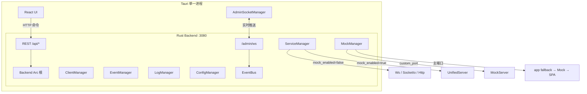
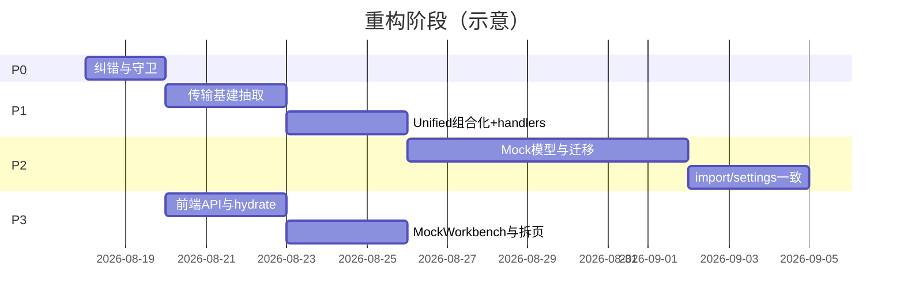

# Socket 服务管理平台 — 修改与重构建议

| 字段 | 内容 |
|------|------|
| 文档类型 | 架构评审 / 重构建议 |
| 版本 | 1.0 |
| 日期 | 2026-08-13 |
| 范围 | `src/`（React 前端）+ `src-tauri/src/backend/`（Rust 后端） |
| 状态 | 建议稿（未实施） |
| 依据 | 代码静态分析；非运行时 profiling |

---

## 1. 执行摘要

本项目是基于 **Tauri 2** 的桌面应用：前端 React 控制台 + 集成于 Tauri 进程的 **Rust/axum** 后端，用于管理、监控与调试 WebSocket / Socket.IO / HTTP 受管服务，并扩展了 **Mock HTTP** 能力。

当前最大结构性债务来自产品能力扩展后**领域模型未收敛**：

1. **三套重叠的 Mock 概念**（独立 Mock 服务 / 服务内嵌 Mock / HTTP 业务路由）并存，规则匹配与响应逻辑多处复制。
2. **`UnifiedServer`（约 820 行）** 通过分叉复制 `HttpServer` + Mock + WS，而不是组合复用，导致修一处常要改两处。
3. **传输层基建复制**（IP 过滤、端口占用重试、hooks），安全策略已出现漂移（Socket.IO 未统一应用 IP 白名单）。
4. **前后端契约与数据流不齐**：部分 DTO 缺 `camelCase`、配置导入不刷新运行时、前端双发送路径、Mock 伪称 WS 同步。

**建议策略**：先 **P0 纠错** → **P1 传输/API 基建** → **P2 统一 Mock 领域模型** → **P3 前端整洁与体验**。其中 P0/部分 P1 可独立合入，风险低、收益高。

---

## 2. 现状功能地图

### 2.1 产品能力

| 模块 | 路由 / 入口 | 职责 | 主要通道 |
|------|-------------|------|----------|
| 仪表盘 | `/` | 服务状态、连接数、收发统计概览 | REST + Admin WS `runtime_update` |
| 服务管理 | `/servers` | 受管服务 CRUD、启停/重启、协议配置；可选内嵌 Mock | REST + WS |
| Mock 服务 | `/mock` | 独立 HTTP Mock（主端口 `basePath` 或 `customPort`） | REST only |
| 客户端管理 | `/clients` | 在线客户端、单播、断开 | REST + WS `client_update` |
| 事件管理 | `/events` | 事件规则、轮询广播、默认消息 | REST |
| 消息中心 | `/messages` | 广播/定向发送、本地草稿（localStorage） | REST |
| 日志查看 | `/logs` | 过滤、实时流、导出、清空 | WS `log_*` + REST |
| 系统设置 | `/settings` | 心跳、WSS、IP 名单、托盘、导入导出 | REST |
| 系统托盘 | Tauri tray | 显示窗口、启停/重启全部服务 | Tauri event → REST |

### 2.2 技术栈与运行时

| 层级 | 技术 |
|------|------|
| 桌面壳 | Tauri 2 |
| 前端 | React 19、TypeScript、Vite 6、Ant Design 5、Zustand、React Router 7 |
| 后端 | Rust：`axum` REST、`/admin/ws` 管理通道、`socketioxide`、`tokio-tungstenite` |
| 配置 | `config/config.json`（经 ConfigManager 读写） |



### 2.3 配置与协议面

- **受管服务协议**：`websocket` | `socket.io` | `http`
- **Mock 挂载**：
  - 独立服务：`PersistedConfig.mock_services[]`（`MockServiceConfig`）
  - 服务共端口：`ServerConfig.mock_enabled` + `mock_rules` + 默认响应字段
- **管理通道事件**：`heartbeat` / `runtime_update` / `client_update` / `log_batch` / `log_update`

---

## 3. 架构热点与复杂度

按行数（约）排序的维护热点：

| 文件 | 行数 | 说明 |
|------|------|------|
| `transport/unified.rs` | ~820 | WS + HTTP + Mock 合一，最大风险点 |
| `pages/ServerManager/ServerManagerPage.tsx` | ~633 | 上帝页：CRUD + Mock Tab + TestTab |
| `backend/types.rs` | ~592 | 全量 DTO |
| `pages/LogViewer/LogViewerPage.tsx` | ~488 | 过滤/导出/实时流一体 |
| `api/handlers.rs` | ~475 | 全路由处理 + Mock CRUD 内联 |
| `transport/http.rs` | ~471 | 与 Unified 高度重复 |
| `managers/service_manager.rs` | ~445 | 工厂 + hooks + 消息 |
| `components/MockComponents.tsx` | ~439 | 已抽取规则/编辑器，页面仍重复 |
| `types/index.ts` | ~408 | 混入未实现能力类型 |
| `pages/Mock/MockServicesPage.tsx` | ~389 | 独立 Mock 页，与 Server Mock 重叠 |

---

## 4. 问题诊断

### 4.1 三套 Mock / HTTP 概念重叠（P0 产品债）

| 概念 | 配置位置 | 运行时 | 端口模型 |
|------|----------|--------|----------|
| Standalone Mock | `mock_services[]` | `MockManager` + `mock/server.rs::dispatch` | 主端口 `:3080` + `basePath`，或 `customPort` |
| Unified Mock（服务内嵌） | `ServerConfig.mock_*` | `UnifiedServer::mock_dispatch` | 与受管服务同端口 |
| Managed HTTP routes | `ServerConfig.http_routes` | `HttpServer` / Unified | inbound / SSE，非规则 Mock |

**后果**：

- 用户心智分裂：「Mock 服务」菜单 vs 服务详情里「启用 Mock HTTP」。
- 规则匹配、查询解析、默认响应逻辑双份（`mock/server.rs` vs `unified.rs`）。
- `config.json` 中规则可能分散存储，导入/导出口径易不一致。

### 4.2 UnifiedServer 分叉复制（P0 代码债）

`ServiceManager::start` 在 `mock_enabled=true` 时**一律**构造 `UnifiedServer`：

```187:197:src-tauri/src/backend/managers/service_manager.rs
        let transport: Arc<dyn Transport> = if cfg.mock_enabled {
            // ===== 统一路由模式：Mock HTTP + Socket 共端口 =====
            let unified = Arc::new_cyclic(|weak| {
                UnifiedServer::new(cfg, sys, hooks, weak.clone())
            });
            unified.start().await?;
            unified as Arc<dyn Transport>
```

而 `UnifiedServer` 对 Socket.IO 仅打印警告，仍走 axum 栈——**不会真正启动 Socket.IO**：

```679:685:src-tauri/src/backend/transport/unified.rs
        // Socket.IO 协议不支持统一路由（hyper 1.0 与 axum 0.7 不兼容）
        if self.cfg.protocol == ProtocolType::SocketIo {
            eprintln!(
                "[UnifiedServer] Socket.IO 协议不支持统一路由模式，Mock HTTP 将不生效（服务: {}）",
                self.cfg.id
            );
        }
```

另：`http.rs` 与 `unified.rs` 在路径注册、ingress/SSE、查询解析等方面大面积重复；`self_ref` 等字段存在死代码迹象。

### 4.3 传输基建复制与安全漂移

以下模式在多处复制：

- `allow_ip`（Ws / Http / Unified / Mock）
- bind → `AddrInUse` → `release_port` → sleep → rebind（app / websocket / http / socketio / unified / mock）
- `TransportHooks` 定义在 `websocket.rs`，却被全协议依赖（模块归属不当）

**已知漂移**：Socket.IO 路径对系统 IP 名单支持不完整（相关字段存在 `dead_code` 压制迹象），与其它传输不一致。

### 4.4 API / 配置一致性缺陷

| 问题 | 证据/表现 | 影响 |
|------|-----------|------|
| `ClientDisconnect` 缺 `rename_all = "camelCase"` | `handlers.rs` 字段 `client_id`；前端发 `clientId` | 断开客户端可能反序列化失败 |
| `import_config` 只写配置 | 未 `services.reload` / 未 `mock.restore` | 导入“成功”但运行时陈旧 |
| `server_update` 不重启传输 | 改端口/协议/mock 需手动重启 | 配置与运行态不一致 |
| 设置热更新缺失 | 心跳/WSS/IP 在 start 时拷贝进传输 | `/api/settings` 后运行中服务不感知 |
| Mock CRUD 全在 handlers | 无领域门面；错误类型与 server API 不一致 | 难测、易腐化 |
| `templates` / `MessageTemplate` | 持久化存在，无 REST/UI | 死配置面 |
| 日志保留天数 | 设置有、`cleanup_old` 未见实现 | 磁盘增长 |

### 4.5 前端数据流与结构问题

| 问题 | 说明 |
|------|------|
| Mock 伪 WS 同步 | `useMockStore` 注释称通过 Admin WS 更新，且暴露 `setList`，但无事件接线 |
| 双发送路径 | `useMessageStore` → `/send-message`；`useClientStore` → `/client/send`（后端虽有别名，前端语义分裂） |
| servers 列表多源 | `useServerStore.fetchServers` vs `useEventStore.fetchServers`；MessageCenter 可能未 hydrate 导致空下拉 |
| 死类型 | `PressureTest*`、`McpTool*`、`ITransport`、`RootState`、`ServerStats` 等未使用或仅历史残留 |
| 契约漂移 | 前端 `PersistedConfig` 缺 `mockServices`/`templates`；缺客户端 `group` 等字段 |
| 导入扩展名混乱 | 源文件为 `.tsx/.ts`，大量 `import ...jsx/.js`；`@/*` 别名未用 |
| 上帝组件 | `App.tsx`（壳+托盘+主题+路由）、`ServerManagerPage`、`LogViewerPage` |
| TestTab 重复 | Mock 页与 Server 页各有近百行 HTTP 测试 UI |

### 4.6 其它风险

- 配置写入通道 `try_send` 满时可能丢持久化（写风暴场景）。
- `release_port` 强杀占用进程：开发便利 vs 生产误伤风险需文档化/加开关。
- CORS 可能在 router 与 app 层重复叠加。
- README 功能表尚未完整反映 Mock / HTTP 协议扩展（文档漂移）。

---

## 5. 重构目标与原则

### 5.1 目标

1. **一个 Mock 引擎**：匹配与响应只实现一次，被主端口、自定义端口、受管共端口复用。
2. **清晰的两种挂载语义**（对用户可解释）：
   - **独立 Mock 服务**：只做 HTTP Mock，不绑定业务 Socket。
   - **服务附带 Mock**：与某个受管服务同端口（或明确关联），供联调。
3. **传输层可组合**：协议插件 + 共享基建（IP、bind、hooks），禁止再复制 400+ 行。
4. **命令与状态一致**：导入配置、改设置、改服务字段后，运行时行为可预期（自动重启或明确提示）。
5. **前端单一数据源**：启动 hydrate；typed API；共享 MockWorkbench。

### 5.2 原则

- **先纠错、再抽象、后迁模型**：避免未止血就大搬家。
- **组合优于分叉**：Unified 应是薄壳挂载，而不是第二份 HttpServer。
- **YAGNI**：删除未使用类型/API；MCP、压测等未立项能力不进契约。
- **契约优先**：所有请求 DTO `camelCase`；前后端 `PersistedConfig` 字段对齐。
- **可测性**：领域逻辑进 Manager/Engine，handlers 保持薄。

### 5.3 非目标（本阶段不做）

- 重写为微服务 / 拆出独立后端进程。
- 全面升级 axum 生态以强行合并 Socket.IO 与 Unified（可作为远期项单独评估）。
- 重新引入 Node sidecar 或 Socket.IO 管理通道。
- 大规模 UI 视觉改版。

---

## 6. 目标架构

### 6.1 后端目标结构

```
backend/
  app.rs                 # 组合根：组装依赖、启动、fallback 链
  domain/
    mock_engine.rs       # 唯一 Mock 匹配/响应引擎
    ip_access.rs         # 统一 IP 策略
  managers/
    config_manager.rs
    service_manager.rs   # 工厂：协议选择 + 可选挂载 MockEngine
    mock_manager.rs      # 独立 Mock 生命周期 + CRUD 门面
    client_manager.rs
    event_manager.rs
    log_manager.rs
  transport/
    hooks.rs             # TransportHooks（从 websocket.rs 迁出）
    bind.rs              # bind_with_port_release
    websocket.rs         # 纯 WS
    socketio.rs          # 纯 SIO（明确不支持共端口 Mock）
    http.rs              # 可导出 Router 构建函数供组合
    compose.rs           # 薄组合：HttpRouter ± WsUpgrade ± MockEngine
  api/
    handlers/
      servers.rs
      mock.rs
      clients.rs
      events.rs
      logs.rs
      settings.rs
    router.rs
```

**Fallback 链（保持）**：API/AdminWS → 主端口 MockEngine（按 basePath）→ 嵌入 SPA。

### 6.2 Mock 领域模型建议（需产品拍板）

**推荐方案：MockService 为唯一规则载体；Server 仅引用**

```text
MockServiceConfig {
  id, name, rules, defaults, ...
  mount: MainPort { basePath }
       | CustomPort { port, basePath }
       | AttachToServer { serverId }   // 与受管服务共端口
}

ServerConfig {
  // 删除内嵌 mock_rules / mock_enabled / mockDefault*
  // 或保留 mockEnabled 作为「是否挂载关联 Mock」的快捷开关，规则仍指向 mockServiceId
  attachedMockServiceId?: string
}
```

**迁移**：

1. 将现有 `ServerConfig.mock_rules` 迁移为 `MockService` + `AttachToServer`。
2. 配置版本号 bump（`PersistedConfig.version`），启动时自动 migrate。
3. UI：`/mock` 管理规则与挂载；服务页仅选择「附加哪个 Mock」或快捷创建。

**备选方案（改动更小）**：保留两套配置结构，但强制两者调用同一 `MockEngine` API，UI 用同一套 Workbench。适合作为 P2 的过渡态。

### 6.3 前端目标结构

```
src/
  app/                 # AppShell, routes, TrayBridge, theme
  api/                 # typed endpoints（servers/mock/clients/...）
  features/
    servers/
    mock/              # MockWorkbench, HttpTestPanel（Server/Mock 复用）
    clients/
    events/
    messages/
    logs/
    settings/
  shared/
    socket/AdminSocketManager.ts
    store/             # 或 features 内聚
    types/             # 仅 FE 真实使用的契约
```

**启动 hydrate（建议）**：`adminSocket.connect` 成功后统一拉取 `servers + runtimes + clients + mock list`（及可选 events），消除「先开消息中心无服务列表」类问题。

---

## 7. 分项修改建议

### 7.1 P0 — 纠错与安全网（建议 1–2 人日）

| ID | 项 | 改动要点 | 验收 |
|----|----|----------|------|
| P0-1 | `ClientDisconnect` camelCase | 为结构体加 `#[serde(rename_all = "camelCase")]`，补回归测试（对照 `SendBody`） | 前端断开客户端成功 |
| P0-2 | Socket.IO × Mock 守卫 | `mock_enabled && protocol==SocketIo` 时返回明确错误，或 UI 禁用该组合；禁止静默进 Unified | 启动失败有可读错误，不会丢协议 |
| P0-3 | 双重 CORS / 死字段 | 确认 CORS 只挂一层；删除未使用 `self_ref` 等 | 代码检索无死引用；CORS 行为不变 |
| P0-4 | 文档对齐 | README 增补 Mock/HTTP；标明 Socket.IO 不支持共端口 Mock | README 与实现一致 |

### 7.2 P1 — 传输与 API 基建（建议 3–5 人日）

| ID | 项 | 改动要点 | 验收 |
|----|----|----------|------|
| P1-1 | 抽取 `ip_access` | 全传输共用；Socket.IO 接入同一策略 | 黑白名单行为一致 |
| P1-2 | 抽取 `bind_with_port_release` | 替换 6 处复制逻辑 | 端口占用重试行为一致 |
| P1-3 | `TransportHooks` 迁至 `transport/hooks.rs` | 解除对 `websocket.rs` 的错误依赖 | 编译通过；hooks 单测可独立 |
| P1-4 | Unified 组合化 | Unified/compose 调用 `http` 的 router 构建 + `mock_engine::dispatch`；删除重复 WS/SSE/query 代码 | `unified.rs` 显著减行（目标 <400） |
| P1-5 | 拆分 handlers + Mock 门面 | `handlers/mock.rs` 等；CRUD/启停进 `MockManager` | handlers 变薄；Mock 单测不依赖完整 axum |
| P1-6 | 请求 DTO 全面审计 | 所有 JSON body 统一 camelCase；缺测补测 | 前端现有调用全绿 |

### 7.3 P2 — Mock 模型统一与运行时一致（建议 1–2 周）

| ID | 项 | 改动要点 | 验收 |
|----|----|----------|------|
| P2-1 | 产品决策落地 | 采用「MockService 唯一载体 + Server 引用」或过渡态「双配置、单引擎」 | 设计评审签字 |
| P2-2 | `MockEngine` | matcher/responder 唯一入口；主端口/自定义端口/共端口共用 | 同规则三入口行为一致（单测矩阵） |
| P2-3 | 配置迁移 | `version` bump + 启动 migrate；导出含 mock | 旧 config 可自动升级 |
| P2-4 | `import_config` 语义 | 写盘 → reload 配置 → 停受影响服务 → 按 autoStart/原状态恢复 → `mock.restore` | 导入后 UI 与端口行为一致 |
| P2-5 | 设置/服务变更策略 | 文档化「需重启」项；关键字段变更提示或自动 restart | 无静默失效 |
| P2-6 | 清理死配置 | `templates`：实现 API/UI 或从持久化移除 | 无幽灵字段 |

### 7.4 P3 — 前端整洁（建议 3–5 人日，可与 P1 并行部分）

| ID | 项 | 改动要点 | 验收 |
|----|----|----------|------|
| P3-1 | typed `api/` 模块 | `api.servers.start` 等；收敛 send 为单一方法 | 路径字符串不再散落 store |
| P3-2 | 全局 hydrate | App/bootstrap 拉取核心列表 | MessageCenter/Event 无空数据竞态 |
| P3-3 | MockWorkbench | 抽取 Config + Rules + HttpTestPanel；Server/Mock 页复用 | 删除重复 TestTab |
| P3-4 | Mock 实时性 | 接 Admin WS mock 事件，或删除误导注释/`setList`，改为 mutation 后 refetch | 行为与文档一致 |
| P3-5 | 类型瘦身 | 删除 MCP/Pressure/ITransport/RootState 等；补齐 `mockServices`、group | `tsc` 干净；与 Rust 对齐表 |
| P3-6 | 拆壳与上帝页 | `TrayBridge`、`routes`、Server/Log 子组件 | 单文件 <400 行（建议） |
| P3-7 | 导入规范化 | 扩展名统一（推荐无扩展或 `@/`）；开 unused import lint | 导航/搜索不再迷惑 |

### 7.5 可选 / 远期

| ID | 项 | 说明 |
|----|----|------|
| F-1 | 收敛 WS 栈 | 受管 WS 与 Unified 统一为 axum WS 或 tungstenite 之一 |
| F-2 | Socket.IO 共端口 Mock | 需评估 hyper/axum/socketioxide 版本统一，单独立项 |
| F-3 | 日志保留清理 | 实现 `cleanup_old` 对接 `logRetentionDays` |
| F-4 | OpenAPI / 类型生成 | 从 Rust 生成 TS 类型，消灭手工双份 `types` |
| F-5 | 配置写可靠性 | 持久化通道背压策略（阻塞/合并写）替代静默丢弃 |
| F-6 | MCP 能力 | 若需要 AI 集成，基于现有 REST 封装，勿复活旧 Node MCP |

---

## 8. 实施路线图



**推荐并行**：P3-1/P3-2/P3-5 可在 P0 后立即与 P1 并行（前后端接口约定先冻结）。

**里程碑**：

| 里程碑 | 完成标准 |
|--------|----------|
| M1 | P0 全部合入；无静默协议丢失；断开客户端可用 |
| M2 | Unified 行数明显下降；IP/bind 单点实现；handlers 按域拆分 |
| M3 | Mock 单引擎 + 配置迁移；import 刷新运行时 |
| M4 | 前端 typed API + Workbench；上帝页拆分；类型对齐 |

---

## 9. 测试与验收矩阵

### 9.1 必须覆盖的回归场景

| # | 场景 | 期望 |
|---|------|------|
| T1 | 启动纯 WebSocket 服务，外部客户端连接收发 | 正常 |
| T2 | 启动纯 Socket.IO 服务 | 正常；**开启 Mock 时明确失败或 UI 禁用** |
| T3 | 启动 HTTP 服务（inbound + SSE） | 路由与推送正常 |
| T4 | 服务开启共端口 Mock，规则命中/未命中 | 与独立 Mock 引擎行为一致 |
| T5 | 独立 Mock 主端口 basePath | 不遮蔽 `/api`、`/admin`；未匹配回落 SPA |
| T6 | 独立 Mock customPort | 启停端口正确；与 API 端口冲突被拒 |
| T7 | 客户端断开（`clientId`） | 成功断开并从列表移除 |
| T8 | 消息中心广播 / 定向 / 客户端页发送 | 均成功（单一 API 语义） |
| T9 | 事件轮询广播 | 按间隔推送 |
| T10 | 配置导入含 servers + mock_services | 运行时与列表一致 |
| T11 | 修改系统 IP 名单后重启服务 | 策略生效（热更若未做则文档说明） |
| T12 | 托盘启停全部服务 | 与 UI 操作一致 |
| T13 | Admin WS 断线重连 | runtime/client/log 恢复推送 |

### 9.2 建议补齐的自动化

- Rust：`MockEngine` 匹配矩阵单测；DTO camelCase 反序列化测；ServiceManager 工厂对 Socket.IO+Mock 的错误测。
- 前端：api 模块路径快照或契约测；关键 store 的 hydrate 集成测（可选 Playwright，见项目 skill）。

---

## 10. 风险与缓解

| 风险 | 等级 | 缓解 |
|------|------|------|
| Mock 模型迁移破坏旧 config | 高 | versioned migrate；保留一版导出备份；迁移单测 |
| Unified 组合化引入回归 | 高 | 先抽公共函数再删复制；T1–T6 手工+自动 |
| Socket.IO 用户依赖「假 Unified」 | 中 | P0 明确错误；发布说明 |
| 大 PR 难审 | 中 | 严格按 P0→P1→P2 拆 PR；禁止「顺手大扫除」 |
| `release_port` 误杀 | 中 | 设置项或仅开发模式启用；日志告警 |
| 文档/README 再漂移 | 低 | 功能变更同一 PR 改 README |

---

## 11. PR 拆分建议

1. **fix: client disconnect camelCase + Socket.IO mock guard**
2. **refactor(transport): extract ip_access + bind_with_retry + hooks**
3. **refactor(transport): compose Unified from http + mock_engine**
4. **refactor(api): split handlers; MockManager façade**
5. **feat(config): mock model migrate + import reload**（P2，独立大 PR）
6. **refactor(fe): typed api + bootstrap hydrate**
7. **refactor(fe): MockWorkbench + prune types**

每个 PR 需包含：动机一句话、测试说明、是否含配置迁移。

---

## 12. 成功标准（Definition of Done）

- [ ] 不存在「开启 Mock 后 Socket.IO 静默变 axum」路径
- [ ] Mock 匹配/响应逻辑仅一处权威实现
- [ ] 传输层 IP 策略与 bind 重试无复制漂移
- [ ] 所有前端 JSON 请求字段 camelCase 可反序列化（有测）
- [ ] 配置导入后运行时与 UI 一致
- [ ] 前端仅一套 send API；启动后核心列表已 hydrate
- [ ] `types` 无未实现能力残留；与 Rust 持久化字段对齐
- [ ] README / 本文件所述行为与代码一致
- [ ] 热点文件 `unified.rs`、`ServerManagerPage.tsx` 复杂度下降（行数或职责拆分可量化）

---

## 13. 待决问题（实施前需确认）

1. **Mock 产品语义（已决）**：去掉独立 `/mock` 路由与页面；Mock 仅通过「服务管理 → HTTP·Mock」配置。后端 `/api/mock/*` 暂保留。
2. **Socket.IO + Mock**：产品是否需要共端口？若需要，是否单独立项做栈统一（F-2）？UI 已对 SIO 显示警告。
3. **配置导入**：默认「全量重启受影响服务」还是「仅提示用户手动重启」？
4. **`templates`**：补齐消息模板功能，还是从持久化删除？
5. **重构节奏**：是否接受先合入 P0/P1（无 schema 变更），再开 P2 迁移窗口？

---

## 14. 附录

### 14.1 关键路径速查

| 区域 | 路径 |
|------|------|
| 后端入口 | `src-tauri/src/backend/app.rs` |
| 服务工厂 | `src-tauri/src/backend/managers/service_manager.rs` |
| Unified | `src-tauri/src/backend/transport/unified.rs` |
| HTTP 传输 | `src-tauri/src/backend/transport/http.rs` |
| Mock | `src-tauri/src/backend/mock/*` |
| API | `src-tauri/src/backend/api/{router,handlers}.rs` |
| 类型（Rust） | `src-tauri/src/backend/types.rs` |
| 前端壳 | `src/App.tsx` |
| 管理 WS | `src/socket/AdminSocketManager.ts` |
| REST 客户端 | `src/api/client.ts` |
| 类型（TS） | `src/types/index.ts` |
| Mock UI | `src/pages/Mock/MockServicesPage.tsx`、`src/components/MockComponents.tsx` |
| 服务 UI | `src/pages/ServerManager/ServerManagerPage.tsx` |

### 14.2 相关已有文档

- `docs/system_design.md`
- `docs/architecture-rust-backend-rewrite.md`
- `docs/prd-rust-backend-rewrite.md`
- README.md（功能与 API 说明；需随 Mock 扩展更新）

### 14.3 修订记录

| 版本 | 日期 | 说明 |
|------|------|------|
| 1.0 | 2026-08-13 | 首版：功能地图、问题诊断、分阶段重构与验收矩阵 |

---

**下一步**：确认第 13 节待决问题后，可据此拆分为可执行的 implementation plan（按 PR 任务清单），再进入编码。
