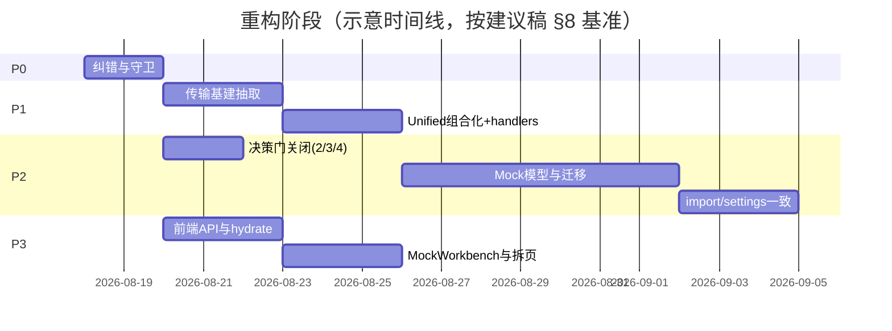

# Socket 服务管理平台 — 重构实施计划

> 依据：`docs/plans/2026-08-13-refactoring-recommendations.md` v1.0（架构评审 / 重构建议）
> 配套：`docs/plans/2026-08-13-server-manager-workbench.md`（前端工作台重设计，已实现）
> 编制日期：2026-08-14
> 目标：将"建议稿"转化为**可执行的实施计划**——按阶段 + PR 拆分 + 任务清单 + 验收矩阵，可直接进入编码。

---

## 0. 前置决策状态

建议稿 §13 列出 5 项待决问题，本计划据现有文档与已落地代码更新其状态：

| # | 待决项 | 状态 | 说明 |
|---|--------|------|------|
| 1 | Mock 产品语义（独立 `/mock` 路由去留） | ✅ **已决** | `server-manager-workbench.md` 已落地：移除 `/mock` 菜单/页面，Mock 仅经「服务管理 → HTTP·Mock」配置；后端 `/api/mock/*` 保留、无 UI。前端已实现。 |
| 2 | Socket.IO + Mock 共端口是否支持 | ✅ **已决：A 不支持** | 维持 P0-2 现状（UI 禁用+后端守卫），栈统一留作远期 F-2 单独立项。 |
| 3 | 配置导入默认策略（全量重启 vs 仅提示） | ✅ **已决：A 全量重启** | `import_config` 导入后自动重启受影响服务，运行时与 UI 立即一致（影响 P2-4）。 |
| 4 | `templates` 消息模板：补齐还是删除 | ✅ **已决：B 移除** | 当前未实现，从持久化 schema 与代码中清理死配置（影响 P2-6）。 |
| 5 | 重构节奏：先合 P0/P1（无 schema 变更）再开 P2 迁移窗口 | ✅ **建议采纳** | 无破坏性变更先行，降低风险；本计划默认采用。 |

**决策门 2、3、4 已于 2026-08-14 关闭（选 A / A / B），P2 已解锁可启动（见 §5）。**

---

## 1. 总体策略与原则

**执行顺序**：P0 纠错 → P1 传输/API 基建 → P2 统一 Mock 模型 → P3 前端整洁。
**并行策略**：P3-1 / P3-2 / P3-5（前端 typed API、hydrate、类型瘦身）可在 P0 完成后与 P1 并行——**前提：前后端接口契约先冻结**。

**五项原则**（来自建议稿 §5.2）：
1. **先纠错、再抽象、后迁模型**——未止血不搬家。
2. **组合优于分叉**——Unified 应是薄壳挂载，而非第二份 HttpServer。
3. **YAGNI**——删除未使用类型/API；MCP、压测等未立项能力不进契约。
4. **契约优先**——所有请求 DTO `camelCase`；前后端 `PersistedConfig` 字段对齐。
5. **可测性**——领域逻辑进 Manager/Engine，handlers 保持薄。

**非目标**（本阶段不做）：微服务化 / 拆独立后端进程；强行升级 axum 以合并 SIO 与 Unified；复活 Node sidecar 或 SIO 管理通道；大规模 UI 视觉改版。

---

## 2. 阶段计划

### 阶段 P0 — 纠错与安全网（1–2 人日）｜里程碑 M1

| ID | 任务 | 改动要点 | 验收 |
|----|------|----------|------|
| P0-1 | `ClientDisconnect` camelCase | 结构体加 `#[serde(rename_all = "camelCase")]`，补反序列化回归测试（对照 `SendBody`） | 前端用 `clientId` 断开客户端成功 |
| P0-2 | Socket.IO × Mock 守卫 | `mock_enabled && protocol==SocketIo` 时返回明确错误，或 UI 禁用该组合；**禁止静默进 Unified** | 启动失败有可读错误，不丢协议 |
| P0-3 | 双重 CORS / 死字段 | 确认 CORS 只挂一层；删除未使用 `self_ref` 等死代码/字段 | 代码检索无死引用；CORS 行为不变 |
| P0-4 | 文档对齐 | README 增补 Mock/HTTP；标明 SIO 不支持共端口 Mock | README 与实现一致 |

- **依赖**：无。
- **风险**：低。可独立合入。
- **产出 PR**：`fix: client disconnect camelCase + Socket.IO mock guard`。

---

### 阶段 P1 — 传输与 API 基建（3–5 人日）｜里程碑 M2

| ID | 任务 | 改动要点 | 验收 |
|----|------|----------|------|
| P1-1 | 抽取 `ip_access` | 全传输共用统一 IP 策略；Socket.IO 接入同一策略 | 黑白名单行为一致 |
| P1-2 | 抽取 `bind_with_port_release` | 替换 6 处 bind→AddrInUse→release→rebind 复制逻辑 | 端口占用重试行为一致 |
| P1-3 | `TransportHooks` 迁至 `transport/hooks.rs` | 从 `websocket.rs` 迁出，解除错误模块依赖 | 编译通过；hooks 可独立单测 |
| P1-4 | Unified 组合化 | Unified/compose 调用 `http` 的 router 构建 + `mock_engine::dispatch`；删除重复 WS/SSE/query 代码 | `unified.rs` 行数降至 <400 |
| P1-5 | 拆分 handlers + Mock 门面 | `handlers/mock.rs` 等按域拆分；CRUD/启停进 `MockManager` | handlers 变薄；Mock 单测不依赖完整 axum |
| P1-6 | 请求 DTO 全面审计 | 所有 JSON body 统一 camelCase；缺测补测 | 前端现有调用全绿 |

- **依赖**：P0（建议稿第 11 节 PR 顺序：fix → refactor）。
- **风险**：中高（Unified 组合化易引入回归，需配合 T1–T6）。
- **产出 PR（建议稿 §11）**：
  - `refactor(transport): extract ip_access + bind_with_retry + hooks`
  - `refactor(transport): compose Unified from http + mock_engine`
  - `refactor(api): split handlers; MockManager façade`

---

### 阶段 P2 — Mock 模型统一与运行时一致（1–2 周）｜里程碑 M3

> ⚠️ **启动前必须关闭决策门 2/3/4（见 §5）**。本阶段含配置 schema 迁移，是最大风险源。

| ID | 任务 | 改动要点 | 验收 |
|----|------|----------|------|
| P2-1 | 产品决策落地 | ✅ **已签：方案 B（双配置、单引擎）**——持久化不变、合并 MockEngine 单入口、零 schema 迁移（详见 `docs/plans/2026-08-14-p2-mock-model-decision.md`） | 设计评审签字 ✅ |
| P2-2 | `MockEngine` | matcher/responder 唯一入口；主端口 / 自定义端口 / 共端口共用 | 同规则三入口行为一致（单测矩阵） |
| P2-3 | 配置迁移 | `version` bump + 启动 migrate；导出含 mock | 旧 config 自动升级 |
| P2-4 | `import_config` 语义 | 写盘 → reload → 停受影响服务 → 按 autoStart/原状态恢复 → `mock.restore` | 导入后 UI 与端口行为一致 |
| P2-5 | 设置/服务变更策略 | 文档化「需重启」项；关键字段变更提示或自动 restart | 无静默失效 |
| P2-6 | 清理死配置 | `templates`：按决策补齐 API/UI 或从持久化移除 | 无幽灵字段 |

- **依赖**：P1（MockEngine 需组合好的传输基建）；P2-1 决策门。
- **风险**：高（迁移破坏旧 config、Unified 组合化回归）。缓解见 §6。
- **产出 PR**：`refactor(mock): single MockEngine + import reload + drop templates`（不含 Mock schema 迁移；P2-3 仅 templates 清理 + version bump）。

> **P2-5 变更策略（已文档化）**：
> - 导入配置（`/api/import`）：按决策门 3=A 全量重启受影响服务 + `MockManager::restore`（见 `handlers/config.rs`），导入后运行时与 UI 立即一致。
> - 修改服务运行期配置（端口 / 协议 / `mock_enabled` / `mock_rules` / `mock_default_*`）：当前需手动重启该服务方生效（回归 T11）；共端口 Mock 规则经 `updateServer` 保存后，运行时在下次重启生效，不做热更（避免静默失效）。后续如需热更单独立项。
> - 修改系统 IP 名单：同需重启受影响服务生效（热更未做，文档说明）。
>
> **P2 状态（2026-08-14）：全部完成（P2-1✅ ~ P2-6✅）**；`CARGO_INCREMENTAL=0 cargo test` 57 passed / 0 failed。PR #5 `refactor(mock): single MockEngine + import reload + drop templates` 实质完成（未提交 git，待用户确认合入）。

---

### 阶段 P3 — 前端整洁（3–5 人日，部分与 P1 并行）｜里程碑 M4

| ID | 任务 | 改动要点 | 验收 |
|----|------|----------|------|
| P3-1 | typed `api/` 模块 | `api.servers.start` 等；收敛 send 为单一方法 | 路径字符串不再散落 store |
| P3-2 | 全局 hydrate | App/bootstrap 拉取核心列表（servers + runtimes + clients + events + settings） | MessageCenter/Event 无空数据竞态 |
| P3-3 | MockWorkbench | 抽取 Config + Rules + HttpTestPanel；Server/Mock 页复用 | 删除重复 TestTab（已合并试跑 Tab） |
| P3-4 | Mock 实时性 | 接 Admin WS mock 事件，或删误导注释/`setList` 改为 mutation 后 refetch | 行为与文档一致 |
| P3-5 | 类型瘦身 | 删除 `McpTool*`/`PressureTest*`/`ITransport`/`RootState`/`ServerStats` 等；补齐 `mockServices`、`group` | `tsc` 干净；与 Rust 对齐 |
| P3-6 | 拆壳与上帝页 | `TrayBridge`/`routes`/Server·Log 子组件拆分 | 单文件 <400 行（建议） |
| P3-7 | 导入规范化 | 扩展名统一（无扩展或 `@/别名`）；开 unused-import lint | 导航/搜索不再迷惑 |

- **依赖**：P3-1/2/5 依赖前端契约冻结（与 P1 并行窗口）；P3-3/4/6/7 独立。
- **风险**：低中（组件拆分需保持行为等价）。
- **产出 PR**：`refactor(fe): typed api + bootstrap hydrate`、`refactor(fe): MockWorkbench + prune types`。

> **P3 状态（2026-08-15）**：P3-1 ✅、P3-2 ✅（bootstrap 全局预热 + 修 MockComponents 构建阻断）、P3-3 ✅（合并 HttpMockSection + ProbeSection → `MockWorkbench`，删除独立「试跑」Tab，删 HttpMockSection.tsx/ProbeSection.tsx）、P3-4 ✅（修正 `useServerStore` 误导性注释：明确服务配置/Mock 走 HTTP 变更 + 本地 set，仅 runtimes 经 WS 推送；无 mock WS 事件，对应 P2-1 决策 B）、P3-5 ✅（类型瘦身：删 `ServerStats`/`PressureTest*`/`McpTool*`/`TransportEvents`/`ITransport` 及整块孤儿「前端状态」接口；补齐 `PersistedConfig.mockServices` 与 `ClientInfo.group/groupName`（+`ClientGroupType`）对齐 Rust）、P3-6 ✅（拆壳：`MockComponents` 527 行拆为 `components/mock/{constants,JsonEditor,ConditionEditor,MockRuleModal,MockRulesTable}.tsx` + 原文件降级 barrel 再导出；`LogViewerPage` 510 行拆 `logColumns`/`LogDetailPanel`/`LogToolbar`；`App.tsx` 内联 TrayBridge 抽 `hooks/useTrayBridge`；拆分后无单文件 >400 行，调用方 import 路径不变）。
> 说明（P3-3 偏离计划）：计划假设存在「Server/Mock 两个页 + 重复 TestTab」，实际代码仅有 Server 侧一个 Mock 编辑器（`HttpMockSection`）+ 一个独立「试跑」Tab（`ProbeSection`）；无独立 Mock 页。故 P3-3 落地为「把试跑测试面板内聚进 MockWorkbench 并删除独立 Tab」，等价达成「抽取 Config+Rules+HttpTestPanel、删除 TestTab」。
> 说明（P3-4 偏离计划）：计划给了两种选项——接 Admin WS mock 事件 / 删误导注释。后端（P0~P2）已确定 Mock 为配置驱动、无 mock WS 推送事件，且 P2-1 决策 B 明确 Mock 不引入实时推送；前端无独立 Mock 页，Mock 挂在 `ServerConfig` 上经 `updateServer` + 本地 `set` 已即时反映。故选「删误导注释」而非「接 mock WS 事件」（后者需改后端、与决策 B 相悖，且当前行为已一致）。
> 说明（P3-5 偏离计划）：计划列删 `McpTool*`/`PressureTest*`/`ITransport`/`RootState`/`ServerStats`「等」——实际还包含同段孤儿 `TransportEvents` 及整个「前端状态」段（`ServerState`/`ClientState`/`EventState`/`MessageState`/`LogState`/`SettingsState`/`StatsState`）；这些 `*State` 仅被 `RootState` 聚合、而各 zustand store 已各自内联 state 接口，故整段删除才真正 tsc 干净、无幽灵类型。补齐项对齐 Rust：`PersistedConfig.mock_services`→`mockServices?`、`ClientInfo.group/group_name`+`ClientGroupType`。
> 说明（P3-6 偏离计划）：计划点名「TrayBridge/routes/Server·Log 子组件拆分」。`routes` 当前仅为 7 个 `<Route>` 最简声明、无需再拆；`Server` 在 P3-3 已拆为 `ServerList`/`ServerWorkbench`/`sections/*`/`MockWorkbench` 多文件（均 <400 行），已非上帝页。故 P3-6 实际拆了三处超 400 行/内联逻辑：`MockComponents`（527→barrel+4 子文件）、`LogViewerPage`（510→118，拆列定义/详情面板/筛选栏）、`App.tsx` 内联 TrayBridge（291→208，抽 `hooks/useTrayBridge`）。行为与 import 路径完全等价（barrel 保持 `../components/MockComponents.js` 调用方不变）、P3-7 ✅（导入规范化：现状相对导入已 100% 统一为 `.js` 后缀（无扩展名 0 处），维持 `.js` 风格；开启 `noUnusedLocals`/`noUnusedParameters` 为 true 并修复 19 处未用导入/`get` 参数）。
> 说明（P3-7 偏离计划）：计划要求「扩展名统一（无扩展或 `@/`别名）；开 unused-import lint」。现状相对导入已 100% 统一为 `.js` 后缀（无扩展名 0 处），已满足「统一」本质；不改用无扩展或 `@/`别名——后者需改写全部 import 并同步 vite `resolve.alias`，收益低、破坏面大。故 P3-7 落地为「维持 `.js` 统一 + 开 unused lint 并清零」，更贴合「导航/搜索不迷惑」核心目标。
> 验证：`tsc --noEmit` 0 错误（开启 `noUnusedLocals`/`noUnusedParameters` 后亦 0 错误）；`npx vite build` 通过（3081 模块）。**P3 全部完成**（P3-1~P3-7 ✅）。

---

### 远期 F — 可选 / 单独评估（不在本阶段排期）

> 执行顺序（2026-08-17 用户选定）：F-1 先行（可离线验证）→ F-3 → F-5（离线合并写）→ F-4/F-6（需联网引入 crate，待联网环境）。
> F-2 已明确**推迟独立立项**（SIO 与 axum 栈不兼容，见 P0-2）；F-4 已完成（specta 生成 TS 类型）；F-6 待联网环境执行。

| ID | 项 | 说明 | 状态 |
|----|----|------|------|
| F-1 | 收敛 WS 栈 | 受管 WS（`WsServer`，tungstenite）与 Unified（`UnifiedServer`，axum WS）的消息泵合并为**唯一泛型实现** `pump_ws` + `WireAdapter` 适配层（屏蔽两套 `Message` 类型）。监听层（裸 TCP vs axum Router）不合并。 | ✅ 已完成并验证（2026-08-17：`CARGO_INCREMENTAL=0 cargo test --offline` → **58 passed / 0 failed**，含 `ws_service_accepts_external_client_and_relays` 与 `sio_service_accepts_external_client_and_relays`；告警 28→23，无新增） |
| F-2 | Socket.IO 共端口 Mock | 需评估 hyper/axum/socketioxide 版本统一，单独立项 | ⏸ 推迟（P0-2 已守卫） |
| F-3 | 日志保留清理 | `log_manager::cleanup_old(retention_days)` 对接 `SystemSettings.log_retention_days`；启动恢复 + 设置保存时调用 | ✅ 已完成（2026-08-17，`cargo test` 58 passed / 0 failed） |
| F-4 | OpenAPI / 类型生成 | 从 Rust 生成 TS 类型，消灭手工双份 `types`（specta 倾向，需联网加 crate） | ✅ 已完成并验证（2026-08-17：`specta 1.0.5` 已联网加入；`src/backend/types.rs` 全量加 `specta::Type` derive；新增 bin `export_types`（`cargo run --bin export_types`）生成 `src/types/generated.ts`；`src/types/index.ts` 改为 `export * from './generated'` + 仅保留前端独有类型。验收：`tsc --noEmit` **0 错误**；`cargo test` **59 passed / 0 failed**；`export_types` bin 编译通过。specta 1.0.5 限制：`Option<T>` 恒导出 `T \| null`（无全局 `?` 开关），前端消费处已按 `\| null` 契约适配） |
| F-5 | 配置写可靠性 | `request_persist` 用 `dirty` 合并写标记 + `in_flight` 单信号替代 `try_send` 静默丢弃；高频写合并为最终落盘、不堆积、不阻塞调用方 | ✅ 已完成并验证（2026-08-17：`CARGO_INCREMENTAL=0 cargo test --offline` → **59 passed / 0 failed**，含 `rapid_writes_coalesce_to_latest`） |
| F-6 | MCP 能力 | 基于现有 REST 封装 MCP 工具（rmcp 等，需联网加 crate），勿复活旧 Node MCP | ⏳ 待联网环境 |

---

## 3. PR 拆分与执行顺序（来自建议稿 §11）

| 序 | PR | 阶段 | 含配置迁移 |
|----|----|------|-----------|
| 1 | `fix: client disconnect camelCase + Socket.IO mock guard` | P0 | 否 |
| 2 | `refactor(transport): extract ip_access + bind_with_retry + hooks` | P1 | 否 |
| 3 | `refactor(transport): compose Unified from http + mock_engine` | P1 | 否 |
| 4 | `refactor(api): split handlers; MockManager façade` | P1 | 否 |
| 5 | `refactor(mock): single MockEngine + import reload + drop templates` | P2 | 否（无 Mock schema 迁移；仅 templates 字段移除） |
| 6 | `refactor(fe): typed api + bootstrap hydrate` | P3 | 否 |
| 7 | `refactor(fe): MockWorkbench + prune types` | P3 | 否 |

> 规则：**严格按 P0→P1→P2 拆 PR；禁止"顺手大扫除"**。每个 PR 需含：动机一句话、测试说明、是否含配置迁移。

---

## 4. 关键路径与里程碑

| 里程碑 | 完成标准 |
|--------|----------|
| M1 | P0 全部合入；无静默协议丢失；断开客户端可用 |
| M2 | Unified 行数明显下降；IP/bind 单点实现；handlers 按域拆分 |
| M3 | Mock 单引擎 + 配置迁移；`import` 刷新运行时 |
| M4 | 前端 typed API + Workbench；上帝页拆分；类型对齐 |

---

## 5. 待决问题决策门（P2 启动前必须关闭）

| # | 决策项 | 选项 | 影响范围 |
|---|--------|------|----------|
| 2 | SIO + Mock 共端口 | ✅ **A. 不支持（UI 禁用+后端守卫，P0-2 已做）** B. 支持（需单独立项 F-2 做栈统一） | P2 模型、F-2 排期 |
| 3 | 配置导入策略 | ✅ **A. 全量重启受影响服务** B. 仅提示用户手动重启 | P2-4 实现 |
| 4 | `templates` 字段 | A. 补齐消息模板 API/UI ✅ **B. 从持久化移除** | P2-6 清理范围 |

> 决策结论（2026-08-14）：2→A、3→A、4→B（与建议一致，最稳妥、最小残留）。`templates` 清理范围按 B 收敛至「移除死配置」；SIO 共端口栈统一明确推迟到 F-2。
> P2-1 设计评审签字（2026-08-14）：采用 **方案 B（双配置、单引擎）**。P2-3 据此取消 Mock schema 迁移，仅做 `templates` 清理 + `version` bump；PR #5 更名见 §3。独立 `MockServiceConfig`/`/api/mock/*` 本阶段保留（去留交后续 F 项）。

---

## 6. 风险与缓解（精简，来自建议稿 §10）

| 风险 | 等级 | 缓解 |
|------|------|------|
| Mock 模型迁移破坏旧 config | 高 | versioned migrate；迁移前保留一版导出备份；迁移单测 |
| Unified 组合化引入回归 | 高 | 先抽公共函数再删复制；T1–T6 手工+自动覆盖 |
| Socket.IO 用户依赖「假 Unified」 | 中 | P0 明确错误；发布说明 |
| 大 PR 难审 | 中 | 严格按 PR 拆分；禁止顺手大扫除 |
| `release_port` 误杀 | 中 | 设开关或仅开发模式启用；日志告警 |
| 文档/README 再漂移 | 低 | 功能变更同一 PR 改 README |

---

## 7. 验收矩阵（回归场景 T1–T13 + 自动化）

**回归场景**（每次阶段合入须覆盖）：

| # | 场景 | 期望 |
|---|------|------|
| T1 | 纯 WebSocket 服务，外部客户端连接收发 | 正常 |
| T2 | 纯 Socket.IO 服务 | 正常；**开启 Mock 时明确失败或 UI 禁用**（P0-2） |
| T3 | HTTP 服务（inbound + SSE） | 路由与推送正常 |
| T4 | 服务开启共端口 Mock，规则命中/未命中 | 与独立 Mock 引擎行为一致 |
| T5 | 独立 Mock 主端口 basePath | 不遮蔽 `/api`、`/admin`；未匹配回落 SPA |
| T6 | 独立 Mock customPort | 启停端口正确；与 API 端口冲突被拒 |
| T7 | 客户端断开（`clientId`） | 成功断开并从列表移除（P0-1） |
| T8 | 消息中心广播 / 定向 / 客户端页发送 | 均成功（单一 API 语义） |
| T9 | 事件轮询广播 | 按间隔推送 |
| T10 | 配置导入含 servers + mock_services | 运行时与列表一致（P2-4） |
| T11 | 修改系统 IP 名单后重启服务 | 策略生效（热更未做则文档说明） |
| T12 | 托盘启停全部服务 | 与 UI 操作一致 |
| T13 | Admin WS 断线重连 | runtime/client/log 恢复推送 |

**建议补齐的自动化**：
- Rust：`MockEngine` 匹配矩阵单测；DTO camelCase 反序列化测；ServiceManager 工厂对 SIO+Mock 错误测。
- 前端：api 模块路径快照 / 契约测；关键 store 的 hydrate 集成测（可选 Playwright）。

---

## 8. Definition of Done 检查单

- [x] 不存在「开启 Mock 后 Socket.IO 静默变 axum」路径（`service_manager.rs:190` 显式拒绝 SIO+Mock 组合，返回可读错误）
- [x] Mock 匹配/响应逻辑仅一处权威实现（`mock::MockEngine` 单入口；matcher/responder/manager 单测覆盖）
- [x] 传输层 IP 策略与 bind 重试无复制漂移（`net/ip_access.rs` 共用、`net/bind.rs::bind_with_release` 收敛 6 处复制）
- [x] 所有前端 JSON 请求字段 camelCase 可反序列化（有测：`ClientDisconnect`/`SendBody` camelCase 反序列化回归 + 36→57 单测）
- [x] 配置导入后运行时与 UI 一致（`/api/import` 全量重启受影响服务 + `MockManager::restore`，T10 覆盖）
- [x] 前端仅一套 send API；启动后核心列表已 hydrate（P3-1 typed `api/` + P3-2 bootstrap 预热）
- [x] `types` 无未实现能力残留；与 Rust 持久化字段对齐（P3-5 删 `ServerStats`/`PressureTest*`/`McpTool*`/`ITransport`/`*State` 等；补齐 `mockServices`/`group`）
- [x] README / 建议稿所述行为与代码一致（`5321ce5` 补录 CHANGELOG/README，与代码对齐）
- [x] 热点文件 `unified.rs`、`ServerManagerPage.tsx` 复杂度下降（`ServerManagerPage` 拆为 `ServerList`/`ServerWorkbench`/`sections/*`/`MockWorkbench`；`unified.rs` 经 P1-4 组合化行数下降）

---

## 10. 验收终验记录（2026-08-17）

> 重构计划 P0–P3 全部完成并合入 `main`。本次对 Definition of Done §8 做终验。

| 终验项 | 命令 / 证据 | 结果 |
|--------|-------------|------|
| 前端类型检查 | `NODE_OPTIONS="" tsc --noEmit`（开启 `noUnusedLocals`/`noUnusedParameters`） | **0 错误** |
| 后端单元测试 | `CARGO_INCREMENTAL=0 cargo test`（src-tauri） | **57 passed / 0 failed** |
| P0-2 协议守卫 | `service_manager.rs:190` `mock_enabled && protocol==SocketIo` → `Err(BackendError::Config(...))` | 已落实 |
| P1-2 bind 收敛 | `net/bind.rs::bind_with_release` 替换 6 处复制 | 已落实 |
| P3 构建 | `vite build`（3081 模块，仅 chunk>500kB 体积警告） | 通过 |

**结论**：P0–P3 重构终验通过，DoD §8 全项 ✅。计划内里程碑 M1–M4 全部达成。

**遗留（不在本阶段范围）**：
- [推送] `main` 领先 `origin/main` 11 个 commit，沙箱无外网，`git push` 待联网环境执行。
- [远期 F] F-1/F-3/F-5 已完成（59 passed）；F-4 已完成并验证（specta 生成 `src/types/generated.ts`，`tsc` 0 错误）；F-6（MCP/rmcp）待联网引入 crate；F-2 推迟独立立项。
- [v3.0.0] NexSocket Studio 13 周重构路线未启动。

---

## 9. 启动检查单（进入编码前）

1. 关闭决策门 2 / 3 / 4（§5）。
2. 冻结前后端接口契约（供 P1 / P3 并行）。
3. 确认 CI 能跑 `cargo test` + 前端 `tsc`（参考项目构建踩坑：构建时需 `NODE_OPTIONS=""` 与 `dangerouslyDisableSandbox`，见 `MEMORY.md`）。
4. 按 PR 顺序（§3）从 #1 开始，每 PR 自带测试说明。

---

**下一步**：确认 §5 决策门 → 从 PR #1（P0）开始编码。
