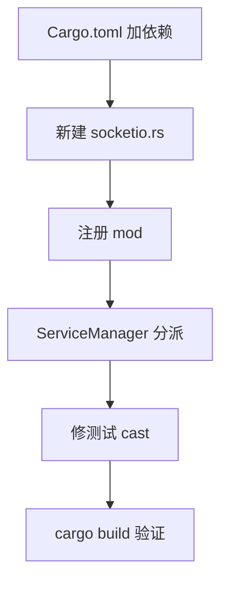

# 设计文档：恢复 Rust 后端「受管 Socket.IO 服务」能力

- **文档版本**：v1.0
- **作者**：架构师 高见远（Gao）
- **日期**：2025
- **对应 PRD**：`docs/prd-rust-backend-rewrite.md`（待确认问题 e：本期受管端只实现纯 WS，本期任务恢复 socket.io）
- **语言**：简体中文
- **范围**：仅架构设计 + 任务分解，不含实现代码（工程师按本文档落地）

---

## 一、实现方案与框架选型

### 1.1 问题回顾

- 数据模型层**已支持** Socket.IO：`types.rs` 的 `ProtocolType` 含 `SocketIo`（`serde rename "socket.io"`）；前端 `ServerManagerPage.tsx` 协议下拉已提供 WebSocket / Socket.IO 两选项。
- **后端缺实现**：`transport/mod.rs` 只 `pub mod websocket`；`service_manager.rs::start()` 硬编码创建 `WsServer`（无视 `cfg.protocol`）；`Cargo.toml` 无 Socket.IO 服务端 crate。
- 结果：用户新建 `socket.io` 服务并启动，后端实际起的是纯 WebSocket 服务，旧「创建 socket.io 服务供外部客户端连接」功能在 Rust 后端消失。

### 1.2 框架选型（确认采用 socketioxide）

| 关注点 | 选型 | 决策理由 |
|---|---|---|
| Socket.IO 服务端 | **`socketioxide = "0.18"`** | Rust 生态事实上的 Socket.IO 服务端实现，兼容官方 JS 客户端 v3+，协议 v5 默认开启，支持 polling + websocket 两种传输；API 基于 `hyper 1.0 / http 1.0` |
| 与现有 axum 0.7 集成 | **tower `Layer` 挂到 `axum::Router`** | 本项目 `axum = "0.7"`、`tower = "0.5"`、`tower-http = { features = ["cors"] }`；axum 0.7 基于 `hyper 1.0 / http 1.0`，socketioxide 同样基于 `hyper 1.0 / http 1.0`、共用同一套 `http`/`tower` 版本。socketioxide 的 `SocketIoLayer` 可直接 `.layer()` 挂到 `axum::Router`，无需自建独立 HTTP 服务 |
| CORS | **`tower_http::cors::CorsLayer::permissive()`** | 浏览器 Socket.IO 客户端初始用 HTTP 轮询握手，需 CORS；本期建议 permissive 即可（管理端 CORS 已具备） |
| 绑定 / 生命周期 | 复用 `websocket.rs` 的 `TcpListener` + `release_port` 重试逻辑 | 端口冲突释放逻辑跨协议通用，保持一致 |
| 抽象层 | 复用现有 `Transport` trait（`#[async_trait]`、`Send + Sync`） | `WsServer` 与新增 `SocketIoServer` 都实现同一 trait；`ServiceManager.servers` 存 `Arc<dyn Transport>` 即可对象安全地按协议分派 |

### 1.3 与 axum 0.7 兼容性结论

- `socketioxide` 与 `axum 0.7` 共用 `http 1.0 / hyper 1.0 / tower 0.5`，理论无版本冲突；`cargo build` 解析顺利则直接 `socketioxide = "0.18"`。
- **冲突兜底**：若 `cargo build` 解析出与 axum 0.7 的 `http` 版本冲突，优先 pin 一个仍用 `http 1.0` 的 socketioxide 小版本；必要时升级 `axum` 到 `0.8`（0.7→0.8 的 `ws` 用法基本一致，作为备选，不在本期默认动作）。

---

## 二、文件列表（相对路径，均在 `src-tauri/` 下）

### 新增
```
src-tauri/src/backend/transport/socketio.rs      # SocketIoServer + impl Transport（本期核心新增）
```

### 修改
```
src-tauri/Cargo.toml                              # 新增 socketioxide 依赖
src-tauri/src/backend/transport/mod.rs            # pub mod socketio;  注册新模块
src-tauri/src/backend/managers/service_manager.rs # ① servers 字段类型 → Arc<dyn Transport>
                                                  # ② start() 内按 cfg.protocol match 分派
                                                  # ③ 测试注入点 cast `as Arc<dyn Transport>`
```

> 说明：`TransportHooks`（连接回调集合）当前定义在 `websocket.rs`。为避免改动 `websocket.rs`，`socketio.rs` 直接 `use crate::backend::transport::websocket::TransportHooks;`（同模块内跨文件引用，Rust 允许）。如后续希望更整洁，可把 `TransportHooks` 上移到 `transport.rs` 再让 `websocket.rs` 重新导出——本期不强制，见第八节待明确事项。

---

## 三、数据结构和接口

### 3.1 现有 `Transport` trait 方法签名（源：`transport.rs`）

```rust
#[async_trait]
pub trait Transport: Send + Sync {
    async fn start(&self) -> Result<(), BackendError>;
    async fn stop(&self) -> Result<(), BackendError>;
    async fn send(&self, client_id: &str, event: &str, data: Value) -> Result<(), BackendError>;
    async fn broadcast(
        &self,
        event: &str,
        data: Value,
        target_ids: Option<Vec<String>>,
    ) -> Result<(), BackendError>;
    async fn disconnect_client(&self, client_id: &str) -> Result<(), BackendError>;
}
```

> 注意：实际 trait **没有** `is_running` 方法（早期架构文档注释里提到过，但 `transport.rs` 里不存在）。`ServiceManager` 通过 `servers` map 是否含该 id、以及 `ServerRuntime.status` 判断运行态，不依赖 trait 方法。

### 3.2 `TransportHooks`（来源：`websocket.rs`，socketio.rs 直接复用）

```rust
pub struct TransportHooks {
    pub on_connect: Arc<dyn Fn(ClientInfo) + Send + Sync>,
    pub on_message: Arc<dyn Fn(String, String, Value) + Send + Sync>,   // (socket_id, event, data)
    pub on_disconnect: Arc<dyn Fn(String) + Send + Sync>,               // socket_id
}
```

### 3.3 新增 `SocketIoServer` 结构体（字段建议）

```rust
pub struct SocketIoServer {
    cfg: ServerConfig,
    sys: SystemSettings,
    hooks: TransportHooks,
    /// socketioxide 句柄（start 内构建，stop 内 take 掉以断开全部连接）
    io: Mutex<Option<socketioxide::SocketIo>>,
    /// socket.id(String) -> SocketRef，供 send/disconnect_client 查找
    clients: Arc<Mutex<HashMap<String, socketioxide::extract::SocketRef>>>,
    running: AtomicBool,
    /// axum::serve 任务的 AbortHandle，stop 时 abort
    abort: Mutex<Option<tokio::task::AbortHandle>>,
}
```

构造签名（**不需要** `Weak<Self>`，因为没有 accept loop 派生 self）：

```rust
impl SocketIoServer {
    pub fn new(cfg: ServerConfig, sys: SystemSettings, hooks: TransportHooks) -> Self {
        Self {
            cfg,
            sys,
            hooks,
            io: Mutex::new(None),
            clients: Arc::new(Mutex::new(HashMap::new())),
            running: AtomicBool::new(false),
            abort: Mutex::new(None),
        }
    }
}
```

### 3.4 `SocketIoServer` 如何满足 `Transport` trait

> 以下为实现要点（伪代码逻辑，非 .rs 文件）。所有方法都通过 `&self` + 内部可变性（Mutex/AtomicBool）工作，满足 `Send + Sync`。

**`start()`**
1. `if running.load(SeqCst) { return Ok(()); }`
2. 绑定 `TcpListener`：`addr = (cfg.ip, cfg.port as u16)`；若 `AddrInUse`，参照 `websocket.rs` 调 `release_port(cfg.port)` 后 `sleep(PORT_RELEASE_RETRY_DELAY_MS)` 重试一次（`use crate::backend::net::port_release::release_port;`）。
3. `let (layer, io) = socketioxide::SocketIo::new_layer();`
4. 注册连接处理闭包（捕获 `clients.clone()`、`hooks.clone()`、`server_id = cfg.id.clone()`、`protocol = cfg.protocol`）：
   - `io.ns("/", move |s: SocketRef| { ... })`：`s` 即 `connect` 回调（每连一个 socket 触发一次，闭包需 `Fn + Send + Sync + 'static`）。
   - 在闭包内：
     - `let sid = s.id.to_string();`
     - `clients.lock().unwrap().insert(sid.clone(), s.clone());`
     - 构造 `ClientInfo { id: sid.clone(), server_id: server_id.clone(), socket_id: sid.clone(), ip_address: <见第八节>, protocol, status: Connected, ..Default::default() }`，调用 `hooks.on_connect(info)`。
     - 注册断开：`s.on_disconnect(move |_s: SocketRef, _reason| { clients.lock().unwrap().remove(&sid); hooks.on_disconnect(sid.clone()); });`
     - 注册兜底事件：`s.on_fallback(move |_s: SocketRef, event: String, Data(data): Data<Value>| { hooks.on_message(sid.clone(), event, data); });`（捕获任意客户端事件，等价于 WS 的 `on_message(socket_id, event, data)`）。
5. `*self.io.lock().unwrap() = Some(io);`
6. 构建 axum Router 并起服务（在 spawn 任务里跑，保存 AbortHandle）：
   ```rust
   let app = axum::Router::new()
       .layer(tower_http::cors::CorsLayer::permissive())   // 外层：先 CORS
       .layer(layer);                                       // 内层：socketioxide
   running.store(true, SeqCst);
   let handle = tokio::spawn(async move {
       if let Err(e) = axum::serve(listener, app).await {
           eprintln!("[SocketIoServer] serve 错误: {}", e);
       }
   });
   *self.abort.lock().unwrap() = Some(handle.abort_handle());
   Ok(())
   ```

**`stop()`**
1. `running.store(false, SeqCst);`
2. 取并 `abort`：`if let Some(a) = self.abort.lock().unwrap().take() { a.abort(); }`（终止 `axum::serve` 任务，关闭监听）。
3. `self.clients.lock().unwrap().clear();`
4. `self.io.lock().unwrap().take();`（drop SocketIo → 断开该服务下全部连接）。
5. `Ok(())`

**`send(client_id, event, data)`**
- `let s = self.clients.lock().unwrap().get(client_id).cloned();`
- `if let Some(s) = s { s.emit(event, data).map_err(|e| BackendError::Internal(e.to_string()))?; }`
- `Ok(())`

**`broadcast(event, data, target_ids)`**
- `target_ids` 为 `None` 或空 → `if let Some(io) = self.io.lock().unwrap().as_ref() { io.broadcast().emit(event, data).map_err(...)?; }`
- 否则遍历 `target_ids`，对每个 id 从 `clients` map 取 `SocketRef` 调 `s.emit(event, data.clone())`。
- `Ok(())`

**`disconnect_client(client_id)`**
- `let s = self.clients.lock().unwrap().remove(client_id);`
- `if let Some(s) = s { let _ = s.disconnect(); }`
- `Ok(())`

### 3.5 类图（Mermaid）

见 `docs/class-diagram.mermaid`（与本文件同步）。要点：`Transport <|.. SocketIoServer`、`ServiceManager o-- "0..*" Transport (dyn)`、`SocketIoServer --> SocketRef (clients map)`。

---

## 四、程序调用流程（时序图 Mermaid）

见 `docs/sequence-diagram.mermaid`。覆盖三条主线：

1. **启动分派**：`ServiceManager::start` → 按 `cfg.protocol` match → 构造 `SocketIoServer` → `start()` 内 `SocketIo::new_layer()` 建 ns 连接回调 → 绑定 `TcpListener`（端口冲突复用 `release_port`）→ `axum::serve(listener, router)` 在 `tokio::spawn` 任务里跑，存 `AbortHandle`。
2. **连接/消息/断开映射**：客户端 HTTP 轮询握手 + WS 升级 → socketioxide 触发 connect 回调 → `clients.insert` + `hooks.on_connect` → 注册 `on_disconnect` / `on_fallback` → 客户端 `emit(event, data)` 命中 `on_fallback` → `hooks.on_message`；断开 → `on_disconnect` → `clients.remove` + `hooks.on_disconnect`。
3. **消息中心下发 / 停止**：`send_message`/`broadcast` 经 `dyn Transport` 调 `send`/`broadcast`（查 `clients` map 拿 `SocketRef.emit`）；`stop` → `running=false` + `abort.abort()` + `clients.clear()` + `io.take()`。

---

## 五、任务列表（有序、含依赖、按实现顺序）

| Task | 名称 | 源文件 | 依赖 | 优先级 |
|---|---|---|---|---|
| **T1** | 添加 socketioxide 依赖 | `Cargo.toml` | — | P0 |
| **T2** | 新建 `socketio.rs` 实现 `SocketIoServer` + `Transport` | `transport/socketio.rs`（新增） | T1 | P0 |
| **T3** | 注册模块 | `transport/mod.rs` | T2 | P0 |
| **T4** | `ServiceManager` 按协议分派 | `managers/service_manager.rs`（`servers` 类型 + `start()` match） | T2, T3 | P0 |
| **T5** | 修复测试中注入 `Arc<WsServer>` 的 cast | `managers/service_manager.rs`（测试块） | T4 | P1 |
| **T6** | `cargo build` 编译验证 | （无新文件，验证性任务） | T5 | P0 |

### 各任务细化

- **T1（Cargo.toml）**：在 `[dependencies]` 增加 `socketioxide = "0.18"`。`tower-http` 的 `cors` feature 已存在，无需改。`tokio` 已含 `rt-multi-thread`/`macros`，`tokio::spawn` 可用。若 `cargo build` 报 `http` 版本冲突，按第一节 1.3 兜底。
- **T2（socketio.rs）**：按第三节 3.3 / 3.4 实现。`use crate::backend::transport::websocket::TransportHooks;`、`use crate::backend::types::*;`、`use crate::backend::constants::*;`、`use crate::backend::error::BackendError;`、`use crate::backend::net::port_release::release_port;`。
- **T3（mod.rs）**：`pub mod socketio;` 并在末尾 `pub use socketio::SocketIoServer;`（供 `service_manager.rs` 引用）。
- **T4（service_manager.rs）**：
  - `use crate::backend::transport::socketio::SocketIoServer;`
  - 字段：`servers: Arc<Mutex<HashMap<String, Arc<dyn Transport>>>>`（原为 `Arc<WsServer>`）。
  - `start()` 改为：
    ```rust
    let protocol = cfg.protocol;
    let transport: Arc<dyn Transport> = match protocol {
        ProtocolType::Websocket => {
            let ws = Arc::new_cyclic(|weak| WsServer::new(cfg, sys, hooks.clone(), weak.clone()));
            ws.start().await?;
            ws as Arc<dyn Transport>
        }
        ProtocolType::SocketIo => {
            let sio = Arc::new(SocketIoServer::new(cfg, sys, hooks.clone()));
            sio.start().await?;
            sio as Arc<dyn Transport>
        }
    };
    self.servers.lock().unwrap().insert(id.clone(), transport);
    ```
    > `cfg` / `sys` 在 match 前 `let protocol = cfg.protocol;` 取出，剩余 move 进对应分支；`hooks` 用 `.clone()` 分别注入。`WsServer::new` 仍要 `weak`（Arc::new_cyclic），`SocketIoServer::new` 不需要。
  - `remove_server` / `broadcast` / `send_message` / `disconnect_client` 中 `servers.get(...)` 得到 `Arc<dyn Transport>`，动态分发调用 trait 方法，无需改调用处。
- **T5（测试）**：`remove_server_refuses_when_running` 现有 `sm.servers.lock().unwrap().insert("live".to_string(), ws);` 改为 `...insert("live".to_string(), ws as Arc<dyn Transport>);`（`ws: Arc<WsServer>` 不变，仅 cast）。其余测试不受影响。
- **T6（编译验证）**：`cargo build`（或 `cargo check`）确保无类型/特征对象对象安全问题；重点验证 `dyn Transport` 对象安全（`Transport` 已是 `Send + Sync` 且所有方法 `&self`，对象安全）、`SocketIoServer` 满足 `Send + Sync`、socketioxide API 签名与本文一致（签名不确定项见第八节，以 `cargo build` 报错为准微调）。

### 任务依赖图（Mermaid）



---

## 六、依赖包列表

```
- socketioxide = "0.18"        # Socket.IO 服务端（基于 hyper 1.0 / http 1.0，兼容官方 JS 客户端 v3+）
- tower-http = { version = "0.5", features = ["cors"] }   # 已存在，本期用其 CorsLayer（无需改）
- axum = "0.7"                  # 已存在，本期用 axum::serve + Router::layer
- tower = "0.5"                 # 已存在，socketioxide 的 Layer 基于 tower
```
> 不引入新传输 crate；`tokio-tungstenite` / `futures-util` 仅 `WsServer` 使用，不受影响。

---

## 七、共享知识（跨文件约定）

1. **`ServiceManager.servers` 类型变更**：`Arc<Mutex<HashMap<String, Arc<WsServer>>>>` → `Arc<Mutex<HashMap<String, Arc<dyn Transport>>>>`。所有 `.insert` / `.get` 调用与测试注入点相应调整（注入时 `as Arc<dyn Transport>`）。
2. **对象安全**：`Transport` trait 方法均为 `&self` 且 `Send + Sync`，`WsServer` 与 `SocketIoServer` 都实现它，可经 `dyn Transport` 对象安全调用。
3. **消息格式差异（固有，可接受）**：WS 客户端收到 `{event, data}` 信封；Socket.IO 客户端收到原始 `(event, data)` emit。消息中心 `send_message` / `broadcast` 对两种协议都只需 `transport.send(socket_id, event, data)` / `transport.broadcast(event, data, target_ids)`，无需感知底层信封差异。
4. **CORS**：Socket.IO 浏览器客户端初始用 HTTP 轮询握手，需在 `Router` 上 `.layer(CorsLayer::permissive())`（本期建议 permissive）。CORS 必须在 socketioxide 层**外侧**（先 CORS 后 socketio）。
5. **端口隔离**：每个 Socket.IO 服务绑定各自 `cfg.ip:cfg.port`，与 `127.0.0.1:3080` 的管理 REST/WS 通道相互独立，互不冲突。`cfg.port == 0` 由上层 `ConfigManager` 负责分配（与 WS 一致），传输层不处理。
6. **客户端 IP**：`SocketRef` 不直接暴露对端地址；`on_connect` 的 `ip_address` 取 `req_parts().headers` 的 `x-forwarded-for` / `x-real-ip`，取不到则回退 `cfg.ip`（best-effort，见第八节）。
7. **清理顺序（stop）**：先 `running=false` → `abort.abort()` 终止 serve 任务 → `clients.clear()` → `io.take()` 断开连接。drop `io` 是关闭全部连接的关键一步。
8. **`hook` 闭包生命周期**：`TransportHooks` 三个闭包均为 `Arc<dyn Fn ... + Send + Sync>`，且内部捕获的 `clients`/`event_bus`/`runtimes` 等均为 `Arc`，`Fn`（非 `FnOnce`），可安全被 socketioxide 的 `Fn + Send + Sync + 'static` 连接回调再次捕获。

---

## 八、待明确事项（API 不确定性 + 推荐写法 + fallback）

> 以下项以 `cargo build` 实测为准；若签名与推荐写法不符，按编译器提示微调（均为机械调整，不影响架构）。

| # | 不确定点 | 推荐写法（socketioxide 0.18） | fallback 方案 |
|---|---|---|---|
| A | `on_fallback` 精确签名 / 参数顺序 | `s.on_fallback(move \|_s: SocketRef, event: String, Data(data): Data<Value>\| { ... })` | 若顺序为 `(event, data, socket)`，调整形参顺序；若回调不接收 `SocketRef`，从闭包外层已捕获的 `sid` 取 socket_id（连接回调里 `s.id.to_string()` 已存入 `sid`，`on_fallback` 闭包直接捕获 `sid.clone()` 即可，无需从参数拿 socket） |
| B | `Data` vs `TryData` | 用 `Data<serde_json::Value>`（`serde_json::Value: DeserializeOwned`）；失败视为非法包，忽略 | 若需容错用 `TryData<Value>`，在闭包内 `match` 处理解析失败 |
| C | `SocketRef::disconnect` 签名 | `s.disconnect()`（返回 `Result`，可忽略或 `let _ =`） | 某些版本为 `s.disconnect().await` 或需 `io` 句柄，按编译器提示调整 |
| D | `s.id` 转字符串 | `s.id.to_string()`（`SocketId: Display`） | 若 `s.id` 为 `&str` 则 `s.id.to_string()` 仍适用 |
| E | `io.broadcast()` vs `io.of("/").emit()` | 全部广播用 `io.broadcast().emit(event, data)`（本期仅 "/" 命名空间，等价） | 如需严格限定命名空间用 `io.of("/").emit(...)` |
| F | 连接回调闭包是否需 `move` 全部捕获 | 连接回调捕获 `clients.clone()`、`hooks.clone()`、`server_id: String`、`protocol: ProtocolType`（均 `Clone`/`Send+Sync+'static`） | 若编译器报捕获非空 `'static`，把 `cfg` 中需要的字段提前 `clone` 成独立 `String`/`ProtocolType` 再捕获 |
| G | 客户端 IP 获取 | `s.req_parts().headers` 读 `x-forwarded-for`/`x-real-ip` | 取不到回退 `cfg.ip`；若 `req_parts()` 不存在，改读 `s.handshake()`（0.18 可能改名），或本期直接写 `cfg.ip` |
| H | `TransportHooks` 归属 | 本期 `socketio.rs` 直接 `use ...websocket::TransportHooks` | 如更整洁，可把 `TransportHooks` 上移到 `transport.rs`，`websocket.rs` 改 `pub use crate::backend::transport::TransportHooks;`（仅 websocket.rs 一处微调，不影响其他） |
| I | 升级 axum 0.8 的影响 | 默认不动；仅在 `cargo build` 报 `http` 版本冲突时考虑 | 升级 `axum` 到 `0.8`，管理端 `extract::ws` / `Router::layer` 用法基本一致，需同步调整 `api/router.rs` 的 `ws` 用法（备选，非默认） |

> 结论：以上均为 socketioxide 0.18 API 的「机械签名」差异，不影响本期架构（trait 抽象、分派逻辑、钩子映射、生命周期均已确定）。实现阶段以 `cargo build` 报错为唯一裁决，逐项按上表 fallback 调整即可。
